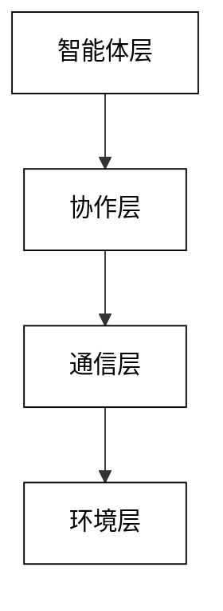
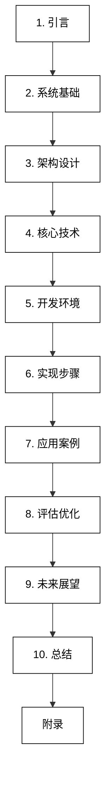

# 基于LLM大模型的多智能体系统 (LLM-based Multi-Agent System) 架构设计指南与开发项目实战

陈光剑 编著

**关键词**：大型语言模型（LLM）、多智能体系统、人工智能、系统架构、协作机制、知识管理、应用开发

**摘要**：
本书深入探讨了基于大型语言模型（LLM）的多智能体系统的架构设计和开发实践。随着人工智能技术的快速发展，LLM在自然语言处理和理解方面取得了突破性进展，而多智能体系统则为复杂问题求解提供了分布式协作的范式。本书旨在将这两个前沿领域有机结合，为读者提供一个全面的指南，涵盖从基础概念到实际应用的各个方面。

本书首先介绍了LLM和多智能体系统的基本原理，然后详细阐述了基于LLM的多智能体系统的架构设计，包括智能体层、协作层、知识管理层等核心组件。在技术实现部分，本书深入讨论了基于LLM的智能体认知模型、多智能体协作算法、知识获取与推理等关键技术。为了帮助读者快速上手，本书还提供了详细的开发环境搭建指南和系统实现步骤。

通过多个实际应用案例，如智能客服系统、协作写作平台、智能教育助手和金融决策支持系统，本书展示了LLM-based多智能体系统在不同领域的潜力和应用方法。此外，本书还探讨了系统评估与优化的方法，以及未来的技术趋势和挑战。

本书适合人工智能研究者、软件工程师、系统架构师以及对LLM和多智能体系统感兴趣的学生和从业者阅读。通过本书，读者将能够掌握设计和开发基于LLM的多智能体系统的核心知识和技能，为未来的智能系统创新奠定坚实基础。

# 序言

在人工智能快速发展的今天，我们正站在一个激动人心的技术变革前沿。大型语言模型（LLM）的出现，标志着自然语言处理和人工智能领域的一次重大突破。这些模型展现出了前所未有的语言理解和生成能力，为人机交互和智能系统开发带来了新的可能性。与此同时，多智能体系统作为一种分布式问题求解的范式，长期以来在复杂系统模拟、协作决策等领域发挥着重要作用。

本书的核心思想是将这两个强大的技术领域——LLM和多智能体系统——进行创新性的结合。我们相信，这种结合将为人工智能系统带来质的飞跃，使其能够更好地处理复杂的实际问题，展现出更高层次的智能和适应性。

作为一名长期从事人工智能和系统架构研究的学者和实践者，我深感有责任将这一前沿领域的知识和经验系统化地整理成书，以期为广大读者提供一个全面而深入的学习资源。本书不仅涵盖了理论基础，更注重实际应用，旨在帮助读者从概念理解到实际开发，全方位掌握基于LLM的多智能体系统的设计和实现。

在撰写本书的过程中，我力求在理论深度和实践指导之间取得平衡。一方面，我们深入探讨了LLM和多智能体系统的核心原理，以及它们结合后产生的新特性和挑战；另一方面，我们提供了详细的架构设计指南、技术实现方法和实际案例分析，确保读者能够将所学知识转化为实际应用能力。

本书的一大特色是其全面性和实用性。从基础概念到高级技术，从系统架构到具体实现，从开发环境搭建到项目实战，我们力求为读者提供一站式的学习体验。特别是在案例分析部分，我们选取了多个不同领域的应用实例，展示了基于LLM的多智能体系统的广泛适用性和潜力。

值得一提的是，本书不仅关注当前技术，还对未来发展趋势进行了展望。人工智能技术日新月异，我们希望通过这本书，不仅能够帮助读者掌握当前最先进的知识和技能，还能激发他们对未来技术发展的思考和探索。

在此，我要特别感谢所有为本书做出贡献的同事和学生。他们的智慧和洞见极大地丰富了本书的内容。同时，我也要感谢我的家人，是他们的支持和理解使我能够专注于这项工作。

最后，我衷心希望这本书能够成为读者在探索LLM和多智能体系统融合领域的可靠指南。无论你是人工智能研究者、软件工程师、系统架构师，还是对这一领域感兴趣的学生，我相信你都能在本书中找到有价值的信息和启发。让我们一起踏上这个激动人心的技术探索之旅，共同推动人工智能的发展，为创造更智能、更美好的未来贡献我们的力量。

陈光剑
2024年11月于北京

# 1 引言

## 1.1 背景与意义

### 1.1.1 LLM大模型的发展现状

大型语言模型（Large Language Models，LLMs）在近年来取得了突破性的进展，成为人工智能领域最受关注的技术之一。这些模型基于深度学习和自然语言处理技术，能够理解和生成人类语言，展现出前所未有的语言能力和认知潜力。

LLM的发展可以追溯到2018年Google发布的BERT（Bidirectional Encoder Representations from Transformers）模型，它首次在多项自然语言处理任务中取得了突破性进展。随后，OpenAI于2020年发布的GPT-3（Generative Pre-trained Transformer 3）将LLM的规模和能力提升到了新的高度，拥有1750亿个参数，能够执行各种复杂的语言任务。

自此，LLM的发展呈现出以下几个主要特征：

1. 规模不断扩大：从GPT-3到更新的模型，参数规模持续增长，部分模型甚至达到了万亿级别。
2. 性能持续提升：在各种自然语言处理任务中，LLM的表现不断超越人类水平，包括阅读理解、问答系统、文本生成等。
3. 多模态融合：最新的LLM开始整合图像、音频等多模态信息，如OpenAI的DALL-E和Google的PaLM。
4. 领域特化：除了通用型LLM，针对特定领域（如医疗、法律、金融）的专业LLM也在快速发展。
5. 开源生态繁荣：如Hugging Face的BERT系列、Meta的LLaMA等开源模型为研究和应用提供了更多可能性。
6. 伦理和安全关注：随着LLM的广泛应用，其潜在的偏见、隐私泄露等问题也引起了广泛讨论。

LLM的这些进展为人工智能带来了革命性的变化，不仅在学术研究中取得了重大突破，也在实际应用中展现出巨大潜力。从智能助手到内容创作，从代码生成到科学研究辅助，LLM正在重塑我们与技术交互的方式。

### 1.1.2 多智能体系统的应用前景

多智能体系统（Multi-Agent Systems，MAS）作为人工智能和分布式计算的交叉领域，在近年来展现出广阔的应用前景。这种系统由多个自主的智能体组成，它们能够相互交互、协作，共同解决复杂问题或完成任务。

多智能体系统的应用前景主要体现在以下几个方面：

1. 复杂系统模拟与优化
   
   - 交通管理：利用多智能体系统模拟城市交通流，优化信号灯控制和路线规划。
   - 供应链管理：模拟和优化复杂的全球供应链网络，提高效率和抗风险能力。
   - 生态系统模拟：模拟复杂的生态系统，预测气候变化影响和物种相互作用。
2. 分布式问题求解
   
   - 分布式计算：利用多个智能体并行处理大规模计算任务，提高效率。
   - 协同设计：在工程设计中，多个专业领域的智能体协作完成复杂系统设计。
   - 分布式传感网络：在物联网应用中，多个智能传感器协同工作，实现大范围环境监测。
3. 自主系统与机器人
   
   - 无人机集群：多个无人机协同完成侦察、搜救或配送任务。
   - 智能制造：工厂中多个机器人和智能设备协同工作，实现柔性生产。
   - 自动驾驶：多辆自动驾驶车辆在道路上相互协调，优化交通流。
4. 智能决策支持
   
   - 金融市场分析：多个智能体模拟不同市场参与者，预测市场动态。
   - 医疗诊断系统：多个专科智能体协作，提供全面的诊断建议。
   - 智慧城市管理：整合多个子系统（如交通、能源、安全）的智能体，实现城市级的智能管理。
5. 社交网络与在线平台
   
   - 社交媒体分析：利用多智能体系统模拟信息传播和舆论形成过程。
   - 在线市场：模拟买家和卖家行为，优化电商平台策略。
   - 游戏AI：在多人在线游戏中，创造智能NPC（非玩家角色）提升游戏体验。
6. 教育与培训
   
   - 个性化学习系统：多个智能体协作，为学生提供定制的学习内容和辅导。
   - 虚拟训练环境：在复杂场景（如飞行模拟、军事演习）中，多个智能体模拟各种角色和情况。
7. 科学研究
   
   - 药物发现：多个智能体协同搜索和评估潜在的药物分子。
   - 天文数据分析：分布式处理和分析来自多个望远镜的海量数据。
8. 安全与防御
   
   - 网络安全：多个智能体协同监测和应对网络攻击。
   - 灾害响应：在自然灾害情况下，协调多个救援单位的行动。

多智能体系统的这些应用前景展现了其在处理复杂、动态、分布式问题上的独特优势。随着人工智能技术的不断进步，特别是与LLM等先进技术的结合，多智能体系统有望在更广泛的领域发挥重要作用，为解决现实世界的复杂问题提供创新解决方案。

### 1.1.3 LLM与多智能体系统结合的优势

LLM（大型语言模型）与多智能体系统的结合代表了人工智能领域的一个重要发展方向，这种融合带来了多方面的优势，为解决复杂问题和创新应用开辟了新的可能性。以下详细探讨这种结合所带来的主要优势：

1. 增强智能体的认知能力
   
   - 自然语言理解与生成：LLM使智能体能够更好地理解和生成人类语言，大大提高了人机交互的自然度和效率。
   - 知识获取与应用：LLM作为庞大的知识库，使智能体能够快速获取和应用广泛的领域知识，提高问题解决能力。
   - 上下文理解：LLM的强大上下文处理能力使智能体能够更好地理解复杂情境，做出更合适的决策。
2. 提升多智能体系统的协作效率
   
   - 高效通信：基于LLM的智能体可以使用更自然、更丰富的语言进行交流，提高信息传递的效率和准确性。
   - 动态角色分配：LLM可以帮助系统更智能地分析任务需求，动态分配最适合的智能体角色。
   - 共识达成：LLM的推理能力可以帮助多个智能体更快地达成共识，解决分歧。
3. 增强问题解决能力
   
   - 复杂任务分解：LLM可以协助将复杂问题分解为子任务，便于多智能体系统的分布式处理。
   - 创新解决方案：LLM的创造性思维能力可以为多智能体系统提供新颖的问题解决思路。
   - 跨领域知识整合：LLM可以帮助整合来自不同领域的知识，促进多学科协作解决问题。
4. 提高系统的适应性和灵活性
   
   - 动态学习：LLM使智能体能够从新信息中快速学习，适应变化的环境。
   - 任务泛化：基于LLM的智能体更容易将学到的知识泛化到新任务中。
   - 情境适应：LLM的强大语言理解能力使系统能够更好地适应不同的应用场景。
5. 增强人机协作
   
   - 自然交互界面：LLM使得人类可以用自然语言与多智能体系统进行复杂的交互。
   - 解释性增强：LLM可以帮助系统生成人类可理解的解释，增加系统的透明度。
   - 个性化交互：LLM可以根据用户特征调整交互方式，提供更个性化的体验。
6. 知识管理与共享的改进
   
   - 知识提取与组织：LLM可以从非结构化数据中提取知识，并组织成多智能体系统可用的形式。
   - 知识图谱构建：利用LLM的语义理解能力，可以更有效地构建和更新知识图谱。
   - 跨域知识迁移：LLM可以帮助不同领域的智能体之间进行知识迁移和共享。
7. 增强系统的创新能力
   
   - 创意生成：LLM的创造性文本生成能力可以为多智能体系统注入创新思维。
   - 假设检验：LLM可以帮助系统生成和评估多种假设，促进创新过程。
   - 跨领域联想：LLM的广泛知识基础可以促进跨领域的创新思考。
8. 提高系统的可扩展性
   
   - 动态集成：LLM使得新的智能体可以更容易地集成到现有系统中，理解其角色和任务。
   - 领域适应：基于LLM的系统可以更容易地适应新的应用领域，减少定制开发的需求。
   - 规模化部署：LLM的通用性使得多智能体系统可以更容易地在不同规模和场景下部署。

结合LLM和多智能体系统不仅提高了单个智能体的能力，也增强了整个系统的协作效率和问题解决能力。这种结合为人工智能系统带来了更高的灵活性、适应性和创新潜力，为解决复杂的现实世界问题提供了强大的工具。随着技术的不断进步，我们可以期待这种结合将在更多领域产生革命性的影响，推动人工智能向着更智能、更自主的方向发展。

## 1.2 基本概念

### 1.2.1 大型语言模型（LLM）简介

大型语言模型（Large Language Models，LLMs）是一类基于深度学习技术，特别是Transformer架构的自然语言处理模型。这些模型通过在海量文本数据上进行预训练，学习语言的统计规律和语义表示，从而能够执行各种复杂的语言任务。以下是对LLM的详细介绍：

1. 定义与特征
   
   - 规模：通常具有数十亿到数千亿个参数。
   - 数据：在TB级别的文本数据上训练。
   - 架构：主要基于Transformer的编码器-解码器或仅解码器结构。
   - 能力：可以理解、生成和转换人类语言。
2. 核心技术
   
   - 自注意力机制：允许模型关注输入序列的不同部分。
   - 预训练-微调范式：先在大规模通用数据上预训练，再在特定任务上微调。
   - 上下文学习：能够从少量示例中学习执行新任务。
3. 主要类型
   
   - 仅编码器模型：如BERT，适合理解任务。
   - 仅解码器模型：如GPT系列，适合生成任务。
   - 编码器-解码器模型：如T5，适合转换任务。
4. 代表性模型
   
   - GPT-3（OpenAI）：1750亿参数，通用语言理解和生成。
   - BERT（Google）：3.4亿参数，擅长语言理解任务。
   - T5（Google）：110亿参数，文本到文本转换。
   - LaMDA（Google）：1370亿参数，对话系统。
   - PaLM（Google）：5400亿参数，多语言和多任务能力。
5. 关键能力
   
   - 自然语言理解：理解复杂语境和隐含意义。
   - 文本生成：创作各种类型的文本，如文章、诗歌、代码。
   - 问答系统：回答开放域问题。
   - 语言翻译：在不同语言间进行高质量翻译。
   - 摘要生成：提取长文本的关键信息。
   - 情感分析：理解文本中的情感和态度。
6. 技术原理
   LLM的核心是基于Transformer架构的深度神经网络。其主要组成部分包括：
   
   a. 输入嵌入层：将文本转换为向量表示。
   
   b. 多层Transformer块：
   
   - 自注意力层：计算输入序列中各元素之间的关联。
   - 前馈神经网络：进行非线性变换。
   - 层归一化：稳定训练过程。
     - 残差连接：缓解梯度消失问题。
   
   c. 输出层：生成最终的预测或生成结果。

数学模型：
自注意力机制是LLM的核心，其计算过程可以表示为：

$$
Attention(Q, K, V) = softmax(\frac{QK^T}{\sqrt{d_k}})V
$$

其中，$Q$、$K$、$V$ 分别表示查询、键和值矩阵，$d_k$ 是键的维度。

7. 训练过程
   
   - 预训练：在大规模无标注数据上进行自监督学习。
     常用目标：掩码语言模型（MLM）或因果语言模型（CLM）。
   - 微调：在特定任务的标注数据上进行有监督学习。
8. 应用领域
   
   - 智能助手和聊天机器人
   - 内容创作和文案生成
   - 代码生成和程序设计辅助
   - 教育和个性化学习
   - 医疗诊断辅助
   - 金融分析和风险评估
   - 法律文件分析和合同审查
9. 挑战与局限性
   
   - 计算资源需求巨大
   - 训练数据可能包含偏见，导致模型输出存在偏见
   - 难以保证输出的事实准确性
   - 隐私和安全问题
   - 解释性和可控性有限
10. 未来发展方向
    
    - 多模态融合：整合文本、图像、音频等多种模态
    - 持续学习：能够不断从新数据中学习，更新知识
    - 提高推理能力：增强逻辑推理和因果推断能力
    - 降低资源需求：开发更高效的模型架构和训练方法
    - 增强可解释性：提高模型决策过程的透明度
    - 伦理和安全：开发更安全、更公平的模型

LLM作为自然语言处理领域的重大突破，正在重塑人机交互的方式，并为众多领域带来创新机遇。随着技术的不断进步，我们可以期待LLM在未来将展现出更强大、更智能的能力，为人工智能的发展开辟新的篇章。

### 1.2.2 多智能体系统定义

多智能体系统（Multi-Agent Systems，MAS）是一种由多个自主智能体组成的分布式人工智能系统。这些智能体能够相互交互、协作，共同解决复杂问题或完成任务。以下是对多智能体系统的详细定义和解释：

1. 核心概念

多智能体系统的核心概念可以概括为：

- 智能体（Agent）：系统中的基本单元，具有自主性、反应性、主动性和社交能力。
- 环境（Environment）：智能体所处的外部世界，可以是物理的或虚拟的。
- 交互（Interaction）：智能体之间以及智能体与环境之间的信息交换和影响。
- 组织（Organization）：定义智能体之间的关系和协作结构。
- 协作（Collaboration）：多个智能体为实现共同目标而进行的协调行为。

2. 形式化定义

多智能体系统可以形式化定义为一个五元组：

$$
MAS = (A, E, I, O, C)
$$

其中：

- $A = \{a_1, a_2, ..., a_n\}$ 是系统中的智能体集合
- $E$ 表示环境
- $I$ 定义了智能体间的交互协议
- $O$ 描述了系统的组织结构
- $C$ 表示协作机制

3. 智能体的特性

在多智能体系统中，每个智能体通常具有以下特性：

- 自主性（Autonomy）：能够独立做出决策和行动。
- 反应性（Reactivity）：能够感知环境并及时响应变化。
- 主动性（Proactivity）：能够主动采取行动以实现目标。
- 社交能力（Social ability）：能与其他智能体进行交互和协作。

4. 系统架构

多智能体系统的架构通常包括以下层次：

5. 交互模式

多智能体系统中的交互可以分为几种主要模式：

- 直接通信：智能体之间直接交换信息。
- 间接通信：通过环境或中介进行信息交换。
- 协商：智能体通过讨论达成共识。
- 协调：智能体调整各自行为以实现整体目标。

6. 决策机制

多智能体系统中的决策通常涉及以下机制：

- 分布式问题求解：将大问题分解为子问题，由不同智能体解决。
- 集体决策：多个智能体共同参与决策过程。
- 博弈论方法：基于智能体之间的竞争与合作关系进行决策。

7. 学习与适应

多智能体系统具有学习和适应能力，主要体现在：

- 个体学习：单个智能体通过经验改善自身行为。
- 集体学习：整个系统通过智能体间的知识共享和协作提升整体性能。
- 进化算法：模拟生物进化过程，优化系统结构和行为。

8. 应用领域

多智能体系统在多个领域有广泛应用，包括：

- 智能交通系统
- 电子商务
- 机器人集群
- 分布式传感网络
- 智能电网
- 虚拟现实和游戏
- 社会模拟

9. 挑战与研究方向

多智能体系统面临的主要挑战包括：

- 协调与冲突解决：如何在多个自主智能体之间实现有效协调。
- 可扩展性：如何设计能够适应大规模智能体数量的系统。
- 安全与隐私：如何保证系统的安全性和智能体间的信息隐私。
- 不确定性处理：如何在动态和不确定环境中做出决策。
- 人机协作：如何实现多智能体系统与人类用户的有效交互。

10. 评估指标

多智能体系统的性能评估通常考虑以下指标：

- 整体目标达成度
- 资源利用效率
- 系统稳定性和鲁棒性
- 适应性和学习能力
- 通信开销
- 决策速度和质量

多智能体系统作为一种强大的分布式人工智能范式，为解决复杂问题提供了新的思路和方法。随着技术的不断进步，特别是与大型语言模型等先进AI技术的结合，多智能体系统有望在更广泛的领域发挥重要作用，推动人工智能向着更智能、更自主、更协作的方向发展。

### 1.2.3 LLM-based多智能体系统的特点

LLM-based多智能体系统是将大型语言模型（LLM）与多智能体系统（MAS）相结合的创新性人工智能架构。这种结合不仅继承了两者的优势，还产生了一些独特的特点。以下是对LLM-based多智能体系统特点的详细阐述：

1. 高度智能的个体智能体

在LLM-based多智能体系统中，每个智能体都可以利用LLM的强大能力：

- 自然语言理解与生成：智能体能够理解复杂的自然语言指令，并生成高质量的文本输出。
- 知识获取与应用：智能体可以从LLM的庞大知识库中快速获取和应用相关知识。
- 推理能力：LLM赋予智能体强大的推理能力，能够处理复杂的逻辑关系。

数学表示：
智能体的能力可以表示为函数 $f_{LLM}$，其输入包括当前状态 $s$、任务 $t$ 和知识库 $K$：

$$
a = f_{LLM}(s, t, K)
$$

其中 $a$ 表示智能体的行动。

2. 高效的智能体间通信

LLM使得智能体之间的通信更加高效和灵活：

- 自然语言交互：智能体可以使用自然语言进行复杂的信息交换。
- 语义理解：LLM的语义理解能力使得智能体间的通信更加准确。
- 上下文感知：智能体能够理解和维护长期对话上下文。

3. 动态角色分配与任务规划

系统可以根据任务需求动态分配角色和规划任务：

- 智能任务分解：利用LLM将复杂任务分解为子任务。
- 角色识别与分配：根据任务需求和智能体能力动态分配角色。
- 自适应规划：能够根据环境变化和任务进展调整计划。

4. 强大的协作问题解决能力

LLM-based系统在协作解决复杂问题方面表现出色：

- 知识整合：整合来自不同智能体的知识和见解。
- 创新解决方案：利用LLM的创造性思维能力生成新颖解决方案。
- 多视角分析：从不同角度分析问题，提供全面的解决方案。

5. 增强的学习与适应能力

系统展现出强大的学习和适应能力：

- 持续学习：智能体可以从交互和任务执行中不断学习，更新知识库。
- 知识迁移：将一个领域的知识迁移到新的问题域。
- 元学习：学习如何更有效地学习和适应新环境。

数学模型：
系统的学习过程可以表示为：

$$
K_{t+1} = K_t + \Delta K(E_t, I_t)
$$

其中 $K_t$ 是时间 $t$ 的知识状态，$E_t$ 是环境信息，$I_t$ 是智能体间的交互信息。

6. 高度的可扩展性

LLM-based多智能体系统具有优秀的可扩展性：

- 智能体数量：系统可以轻松扩展到大量智能体。
- 任务域扩展：可以快速适应新的任务领域。
- 知识扩展：持续集成新知识，扩展系统能力。

7. 增强的人机交互

系统提供了更自然、更智能的人机交互方式：

- 自然语言接口：用户可以使用自然语言与系统交互。
- 上下文理解：系统能够理解复杂的人类意图和上下文。
- 个性化交互：根据用户特征调整交互方式。

8. 复杂环境感知与建模

LLM赋予系统强大的环境理解能力：

- 多模态感知：整合文本、图像等多种模态的环境信息。
- 抽象建模：构建环境的高级抽象表示。
- 预测能力：基于历史数据预测环境变化。

9. 伦理决策与价值对齐

LLM-based系统在伦理决策方面具有独特优势：

- 伦理推理：利用LLM进行复杂的伦理推理。
- 价值对齐：确保系统行为与人类价值观一致。
- 透明度：提供决策过程的解释和理由。

10. 创新与创造力

系统展现出前所未有的创新能力：

- 创意生成：产生新颖的想法和解决方案。
- 跨领域联想：结合不同领域的知识创造新概念。
- 假设检验：生成和评估创新假设。

11. 鲁棒性与容错能力

LLM-based系统具有较强的鲁棒性：

- 不确定性处理：能够处理模糊和不完整的信息。
- 错误恢复：在单个智能体失效时保持系统功能。
- 自我诊断：识别和修复系统中的问题。

12. 可解释性与透明度

尽管LLM本身的可解释性有限，但系统整体提供了更好的透明度：

- 决策解释：生成人类可理解的决策理由。
- 行为追踪：记录和分析智能体的行为过程。
- 知识溯源：追踪知识和决策的来源。

LLM-based多智能体系统的这些特点使其成为一种极具潜力的人工智能架构。它不仅继承了LLM的强大语言能力和多智能体系统的分布式协作优势，还在智能交互、适应性学习、创新能力等方面展现出独特的优势。这种系统有望在复杂问题求解、智能决策支持、人机协作等领域带来革命性的变革，推动人工智能向着更智能、更自主、更协作的方向发展。

## 1.3 研究目标与内容概述

### 1.3.1 主要研究目标

本研究的主要目标是设计、实现和评估基于大型语言模型（LLM）的多智能体系统，以解决复杂的实际问题并推动人工智能技术的发展。具体研究目标包括：

1. 架构设计
   
   - 开发一个灵活、可扩展的LLM-based多智能体系统架构。
   - 设计智能体、协作层、知识管理层等核心组件的接口和交互机制。
   - 制定系统的通信协议和数据流模型。
2. 智能体模型
   
   - 基于LLM设计高度智能的个体智能体模型。
   - 实现智能体的自然语言理解、知识获取、推理和决策能力。
   - 开发智能体的自适应学习和知识更新机制。
3. 协作机制
   
   - 设计基于自然语言的智能体间高效通信机制。
   - 开发动态任务分配和角色分配算法。
   - 实现基于LLM的协商和共识达成机制。
4. 知识管理
   
   - 设计分布式知识表示和存储方案。
   - 实现基于LLM的知识提取、整合和更新机制。
   - 开发跨域知识推理和知识迁移技术。
5. 问题求解能力
   
   - 提高系统在复杂问题分解和解决方面的能力。
   - 增强系统的创新解决方案生成能力。
   - 开发多视角分析和决策支持机制。
6. 学习与适应
   
   - 实现系统的持续学习和知识积累机制。
   - 开发智能体间的知识共享和协同学习算法。
   - 提高系统在动态环境中的适应能力。
7. 人机交互
   
   - 设计自然、智能的人机交互接口。
   - 实现基于LLM的上下文理解和个性化交互。
   - 开发系统行为的可解释性机制。
8. 伦理与安全
   
   - 制定LLM-based多智能体系统的伦理准则。
   - 开发隐私保护和安全机制。
   - 实现系统行为的可控性和可审核性。
9. 性能评估
   
   - 建立全面的性能评估指标体系。
   - 开发系统性能的量化评估方法。
   - 进行大规模实验和对比分析。
10. 应用验证
    
    - 在多个实际应用领域部署和测试系统。
    - 评估系统在不同场景下的效果和局限性。
    - 收集用户反馈并持续优化系统。

通过实现这些研究目标，我们旨在推动LLM-based多智能体系统的理论和实践发展，为解决复杂的现实世界问题提供创新的技术方案。

### 1.3.2 关键技术挑战

在实现基于LLM的多智能体系统的过程中，我们面临着一系列关键技术挑战。这些挑战涉及系统架构、智能体设计、协作机制、知识管理等多个方面。以下是主要的技术挑战及其详细分析：

1. LLM与多智能体系统的深度融合
   
   - 挑战：如何有效地将LLM的能力整合到多智能体系统的各个层面。
   - 分析：这需要重新设计智能体的认知模型、决策机制和交互协议，以充分利用LLM的语言理解和生成能力。同时，还需要考虑如何在分布式环境中高效部署和调用LLM。
2. 智能体间的高效通信
   
   - 挑战：设计基于自然语言的智能体通信机制，同时保证通信的效率和准确性。
   - 分析：虽然LLM提供了强大的语言处理能力，但在多智能体环境中，需要平衡通信的丰富性和计算开销。此外，还需要解决可能出现的歧义和误解问题。
3. 动态任务规划与分配
   
   - 挑战：在复杂、动态的环境中，实现基于LLM的智能任务分解和分配。
   - 分析：这要求系统能够理解任务的语义，评估智能体的能力，并动态调整分配策略。同时，还需要处理任务依赖性和资源竞争等问题。
4. 分布式知识管理
   
   - 挑战：设计能够支持LLM-based智能体的分布式知识表示、存储和检索系统。
   - 分析：需要考虑如何有效组织和索引从LLM获取的大量非结构化知识，同时确保知识的一致性和更新效率。
5. 协同学习与知识共享
   
   - 挑战：实现智能体间的有效知识共享和协同学习机制。
   - 分析：这涉及到如何在保护隐私的前提下共享知识，如何处理潜在的知识冲突，以及如何将个体学习成果转化为集体智慧。
6. 系统可扩展性
   
   - 挑战：确保系统在智能体数量和任务复杂度增加时保持高效运行。
   - 分析：这需要优化系统架构，设计高效的资源分配策略，并可能需要引入分层或联邦学习等技术。
7. 不确定性和鲁棒性
   
   - 挑战：提高系统在面对不完整信息、噪声数据和动态环境时的鲁棒性。
   - 分析：需要开发先进的不确定性推理技术，增强系统的错误恢复能力，并设计适应性强的决策机制。
8. 伦理决策与价值对齐
   
   - 挑战：确保LLM-based多智能体系统的决策符合伦理标准并与人类价值观一致。
   - 分析：这需要在系统设计中嵌入伦理推理能力，开发价值对齐技术，并建立有效的人类监督机制。
9. 可解释性与透明度
   
   - 挑战：提高系统决策过程的可解释性和透明度。
   - 分析：虽然LLM本身的可解释性有限，但需要开发技术来追踪和解释系统的推理过程，生成人类可理解的决策理由。
10. 计算资源管理
    
    - 挑战：在有限的计算资源下，实现LLM-based多智能体系统的高效运行。
    - 分析：需要开发智能的资源分配策略，可能涉及模型压缩、分布式计算、边缘计算等技术的应用。
11. 安全性与隐私保护
    
    - 挑战：保护系统和用户数据的安全，防止恶意攻击和隐私泄露。
    - 分析：需要设计安全的通信协议，实现智能体的身份认证，并开发隐私保护计算技术。
12. 跨域适应性
    
    - 挑战：提高系统在不同领域和场景中的适应能力。
    - 分析：这要求开发高效的知识迁移技术，设计灵活的智能体架构，并实现快速的领域适应机制。
13. 人机协作界面
    
    - 挑战：设计直观、高效的人机交互接口，使人类用户能够轻松地与系统协作。
    - 分析：需要利用LLM的自然语言处理能力，开发多模态交互技术，并设计适应不同用户需求的个性化界面。
14. 长期记忆与上下文管理
    
    - 挑战：实现系统的长期记忆能力和有效的上下文管理。
    - 分析：这涉及到如何存储和检索长期知识，如何维护多轮对话的上下文，以及如何在智能体间共享上下文信息。
15. 创新与创造力
    
    - 挑战：提升系统的创新能力，使其能够生成原创性的解决方案。
    - 分析：需要研究如何利用LLM的生成能力来促进创意思维，如何结合多个智能体的观点产生创新，以及如何评估创新的价值。

这些技术挑战的解决将极大地推动LLM-based多智能体系统的发展，使其能够在更复杂、更动态的环境中发挥作用。克服这些挑战需要跨学科的研究努力，包括人工智能、分布式系统、认知科学、伦理学等多个领域的协作。通过持续的创新和实践，我们有望开发出更智能、更可靠、更有价值的人工智能系统。

### 1.3.3 本指南的结构安排

本指南《基于LLM大模型的多智能体系统 (LLM-based Multi-Agent System) 架构设计指南与开发项目实战》旨在提供一个全面、系统的框架，帮助读者理解、设计和实现基于LLM的多智能体系统。指南的结构安排如下：

1. 引言（第1章）
   
   - 介绍背景、基本概念和研究目标
   - 概述关键技术挑战
   - 提供指南结构概览
2. LLM-based多智能体系统基础（第2章）
   
   - 深入探讨LLM技术
   - 详细介绍多智能体系统原理
   - 分析LLM与多智能体系统的融合
3. 系统架构设计（第3章）
   
   - 提出总体架构设计
   - 详细讨论各层次设计（智能体层、协作层、知识管理层等）
   - 分析数据流和控制流
4. 核心技术实现（第4章）
   
   - 深入探讨基于LLM的智能体认知模型
   - 详细介绍多智能体协作算法
   - 讨论知识获取与推理技术
   - 分析自适应学习机制
   - 探讨安全与隐私保护方法
5. 开发环境与工具（第5章）
   
   - 介绍LLM接口和框架选择
   - 讨论多智能体开发平台
   - 推荐辅助工具和库
6. 系统实现步骤（第6章）
   
   - 提供详细的系统实现指南
   - 从需求分析到系统测试的全流程介绍
7. 应用案例实战（第7章）
   
   - 展示多个实际应用案例
   - 包括智能客服、协作写作平台、智能教育助手和金融决策支持系统
8. 系统评估与优化（第8章）
   
   - 讨论性能指标设计
   - 介绍测试方法
   - 分析结果并提供优化建议
   - 探讨持续集成与部署策略
9. 未来展望与挑战（第9章）
   
   - 分析技术趋势
   - 探讨应用前景
   - 讨论潜在挑战
   - 提出研究方向建议
10. 总结（第10章）
    
    - 回顾关键技术
    - 提供最佳实践建议
    - 展望未来发展路线图
11. 附录
    
    - 提供代码示例、算法伪代码
    - 包含部署配置指南
    - 提供常见问题解答和术语表

本指南的结构设计遵循以下原则：

1. 循序渐进：从基础概念到高级应用，逐步深入。
2. 理论结合实践：每个主题都包含理论解释和实际示例。
3. 全面性：涵盖从系统设计到实现、测试和优化的全过程。
4. 实用性：提供大量实际案例和最佳实践建议。
5. 前瞻性：不仅关注当前技术，还探讨未来发展方向。

通过这种结构安排，本指南旨在为读者提供一个全面、系统、实用的学习和参考资源，帮助他们掌握基于LLM的多智能体系统的设计和开发技能。无论是初学者还是有经验的开发者，都能在本指南中找到有价值的信息和指导。

这个结构图展示了本指南的主要章节及其逻辑关系，从基础概念到实际应用，再到未来展望，形成了一个完整的学习路径。每个章节都建立在前面章节的基础上，同时为后续内容奠定基础，确保读者能够系统地学习和掌握基于LLM的多智能体系统的知识和技能。

通过这种结构化的学习路径，读者将能够：

1. 全面理解LLM和多智能体系统的基本原理
2. 掌握设计基于LLM的多智能体系统架构的方法
3. 学习核心技术的实现细节和最佳实践
4. 熟悉相关的开发工具和环境
5. 获得实际系统实现的步骤指导
6. 通过案例学习应用LLM-based多智能体系统解决实际问题
7. 了解如何评估和优化系统性能
8. 洞察该领域的未来发展趋势和挑战

本指南的每个章节都包含以下元素，以确保内容的全面性和实用性：

- 理论基础：深入解释相关概念和原理
- 技术细节：提供算法、模型和实现方法的详细说明
- 代码示例：展示关键功能的实现代码
- 最佳实践：总结经验教训和推荐做法
- 案例分析：探讨实际应用场景和解决方案
- 挑战与解决方案：讨论常见问题及其对策
- 延伸阅读：推荐进一步学习的资源

通过这种全面而系统的结构安排，本指南旨在成为研究人员、开发者和学生在探索和实践基于LLM的多智能体系统领域时的重要参考资源。无论读者的背景如何，都能在本指南中找到有价值的信息，帮助他们在这个快速发展的技术领域中取得进步。

