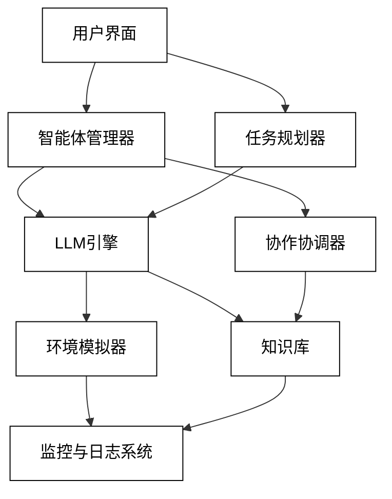
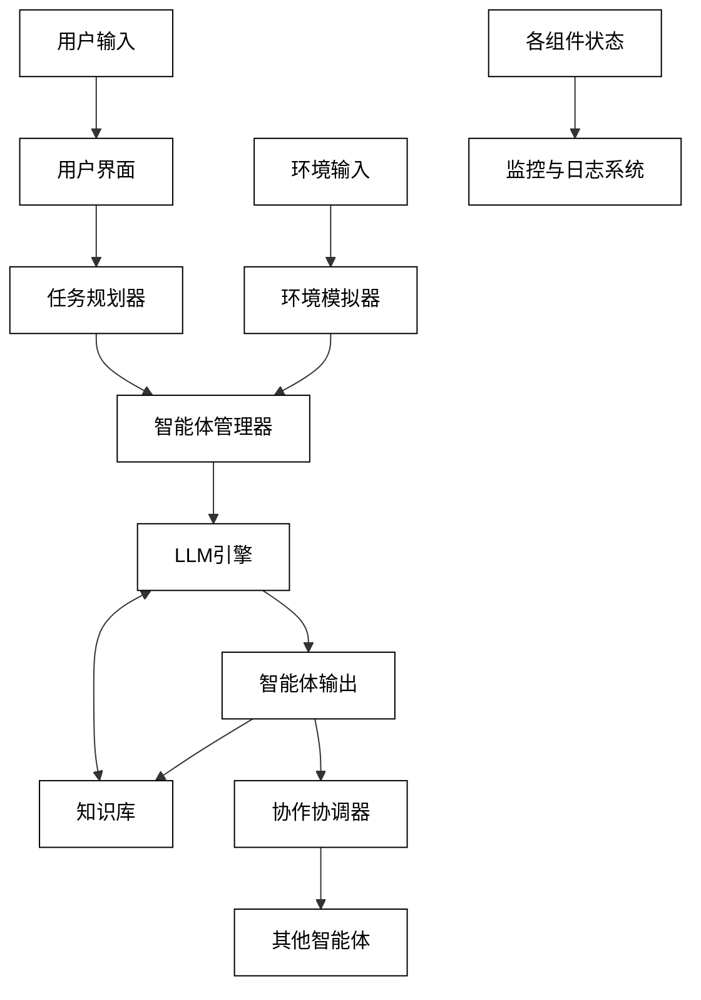
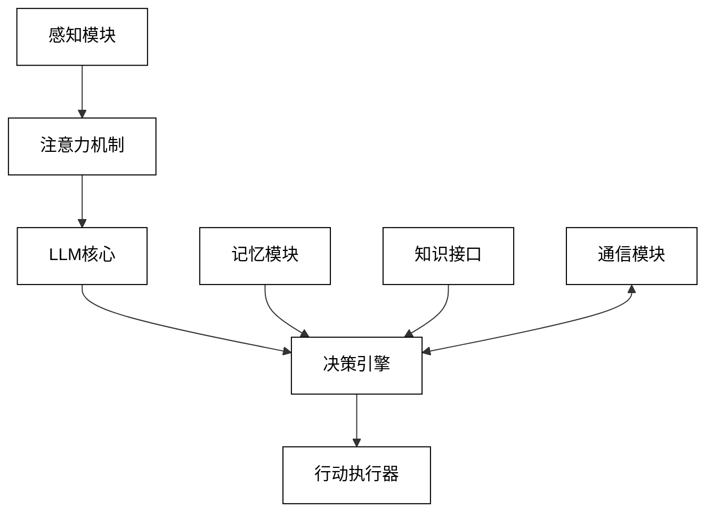
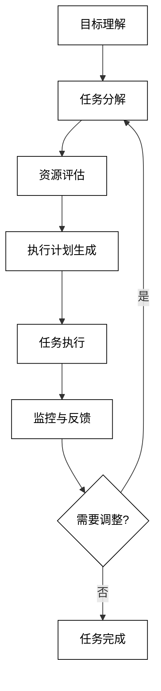
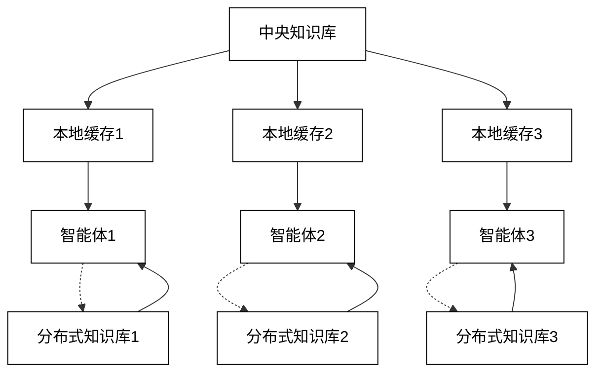
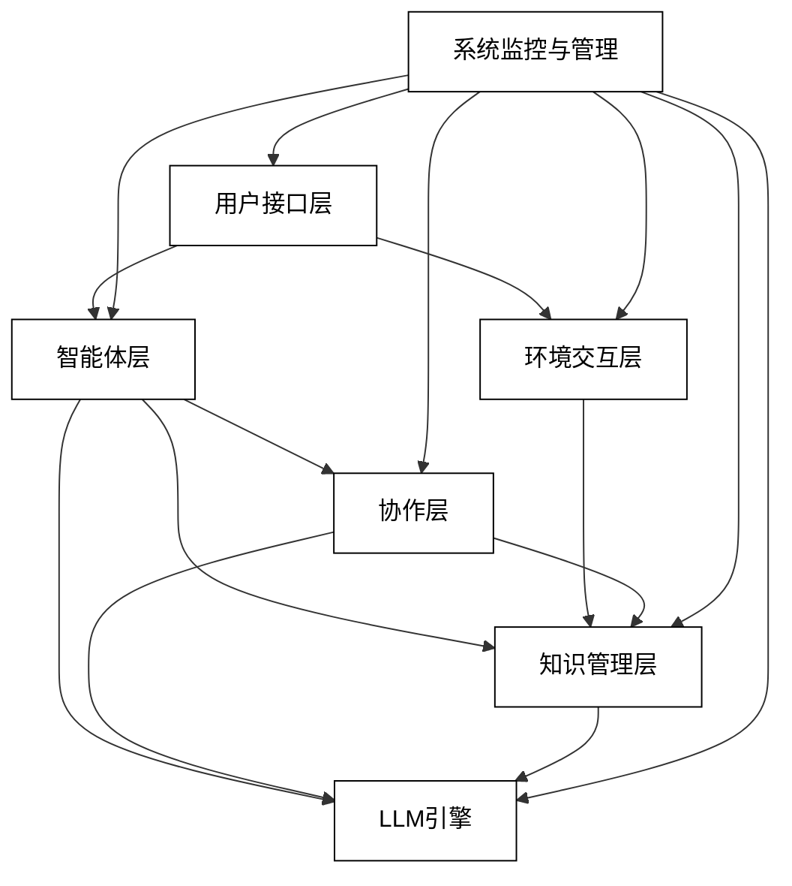

# 3 系统架构设计

关键词：分层架构、智能体模型、协作机制、知识管理、环境交互、用户接口

摘要：本章详细阐述了基于LLM的多智能体系统的架构设计。从总体架构出发，介绍了分层设计原则和核心组件。随后深入探讨了智能体层、协作层、知识管理层、环境交互层和用户接口层的具体设计方案。重点关注了基于LLM的智能体模型、协作机制、知识表示与管理、多模态交互以及用户友好的界面设计。本章为构建高效、可扩展的LLM多智能体系统提供了全面的架构指南。

## 3.1 总体架构

在设计基于LLM的多智能体系统时，采用合理的架构设计至关重要。一个良好的架构不仅能够提高系统的性能和可维护性，还能为未来的扩展和优化提供坚实的基础。本节将详细介绍系统的总体架构，包括分层设计原则、核心组件概述以及数据流与控制流分析。

### 3.1.1 分层设计原则

分层设计是软件架构中的一种常用模式，它将系统划分为不同的功能层，每一层都有其特定的职责。对于基于LLM的多智能体系统，我们采用以下分层设计原则：

1. **模块化原则**：将系统功能划分为独立的模块，每个模块负责特定的功能。这样可以提高代码的复用性和可维护性。

2. **单一职责原则**：每一层应该只负责一个特定的功能领域，避免功能重叠。

3. **抽象原则**：上层应该对下层进行抽象，只依赖于接口而不是具体实现。这样可以提高系统的灵活性和可扩展性。

4. **依赖倒置原则**：高层模块不应该依赖于低层模块，两者都应该依赖于抽象。

5. **松耦合原则**：各层之间应该保持松耦合，通过定义良好的接口进行通信，减少层间依赖。

6. **封装原则**：每一层应该封装其内部实现细节，只暴露必要的接口给其他层使用。

基于这些原则，我们将系统架构分为以下几个主要层次：

- 用户接口层
- 智能体层
- 协作层
- 知识管理层
- 环境交互层

这种分层设计允许我们独立地开发和优化每一层，同时确保整个系统的协调运作。

### 3.1.2 核心组件概述

基于上述分层设计，我们的系统包含以下核心组件：

1. **LLM引擎**：作为系统的核心，负责处理自然语言理解、生成和推理任务。

2. **智能体管理器**：负责创建、配置和管理系统中的各个智能体。

3. **任务规划器**：根据用户输入和系统状态，制定任务执行计划。

4. **协作协调器**：管理智能体之间的通信和任务分配。

5. **知识库**：存储和管理系统的知识，包括领域知识和运行时生成的知识。

6. **环境模拟器**：模拟系统运行的环境，处理多模态输入和输出。

7. **用户界面**：提供用户与系统交互的接口，包括命令行、图形界面和API。

8. **监控与日志系统**：记录系统运行状态，提供实时监控和错误诊断。

下面是系统核心组件的架构图：



### 3.1.3 数据流与控制流分析

在基于LLM的多智能体系统中，数据流和控制流的设计直接影响系统的性能和可靠性。以下是系统主要的数据流和控制流分析：

1. **用户输入流**
    - 数据流：用户输入 -> 用户界面 -> 任务规划器 -> 智能体管理器
    - 控制流：任务规划器根据用户输入决定激活哪些智能体

2. **智能体处理流**
    - 数据流：智能体管理器 -> LLM引擎 -> 知识库 <-> LLM引擎 -> 智能体输出
    - 控制流：智能体管理器控制LLM引擎的调用，LLM引擎根据需要查询和更新知识库

3. **协作流**
    - 数据流：智能体输出 -> 协作协调器 -> 其他智能体
    - 控制流：协作协调器管理智能体间的通信和任务分配

4. **环境交互流**
    - 数据流：环境输入 -> 环境模拟器 -> 智能体 -> 环境模拟器 -> 环境输出
    - 控制流：环境模拟器控制智能体与环境的交互过程

5. **知识更新流**
    - 数据流：智能体输出 -> 知识库
    - 控制流：知识库管理器控制知识的更新和一致性维护

6. **监控与日志流**
    - 数据流：各组件状态 -> 监控与日志系统
    - 控制流：监控系统根据预设规则触发警报或调整系统参数

为了更直观地展示数据流和控制流，我们可以使用以下Mermaid流程图：



在实际系统实现中，需要注意以下几点：

1. **并发处理**：多个智能体可能同时活跃，系统需要能够处理并发请求。

2. **异步通信**：为了提高系统响应性，应采用异步通信机制，特别是在智能体间的协作过程中。

3. **缓存机制**：在知识库访问和LLM调用等高频操作中引入适当的缓存机制，可以显著提升系统性能。

4. **错误处理**：在每个数据流和控制流环节都应该实现robust的错误处理机制，确保系统的稳定性。

5. **可扩展性**：设计时应考虑到未来可能的扩展需求，如添加新的智能体类型或集成新的LLM模型。

通过合理设计数据流和控制流，我们可以构建一个高效、可靠且易于扩展的基于LLM的多智能体系统。在接下来的章节中，我们将深入探讨每一层的具体实现细节。

## 3.2 智能体层

智能体层是基于LLM的多智能体系统的核心，它定义了系统中各个智能体的结构、行为和交互方式。本节将详细介绍智能体层的设计，包括基于LLM的智能体模型设计、角色定义与个性化配置，以及任务规划与执行模块。

### 3.2.1 基于LLM的智能体模型设计

在设计基于LLM的智能体模型时，我们需要考虑如何充分利用LLM的强大能力，同时确保智能体具有自主性、适应性和社交性。以下是智能体模型的关键组成部分：

1. **LLM核心**：
    - 使用预训练的LLM（如GPT-4、BERT、LLaMA等）作为智能体的认知引擎。
    - 实现动态Prompt生成机制，以适应不同任务和上下文。
    - 设计微调策略，使LLM能够适应特定领域任务。

2. **记忆模块**：
    - 短期记忆：存储当前对话或任务相关的即时信息。
    - 长期记忆：保存智能体的经验和学习成果。
    - 工作记忆：用于临时存储和处理当前任务所需的信息。

3. **决策引擎**：
    - 基于LLM输出的多步推理机制。
    - 集成规则引擎，处理明确的逻辑和约束。
    - 实现元认知能力，允许智能体反思和评估自己的决策。

4. **知识接口**：
    - 与知识管理层交互，实现知识的查询、更新和共享。
    - 支持结构化和非结构化知识的处理。

5. **通信模块**：
    - 实现与其他智能体的消息传递机制。
    - 支持多种通信协议，如自然语言、结构化数据等。

6. **感知模块**：
    - 处理来自环境的多模态输入（文本、图像、音频等）。
    - 实现注意力机制，聚焦于任务相关的关键信息。

7. **行动执行器**：
    - 将决策转化为具体的行动指令。
    - 与环境交互层对接，执行实际操作。

智能体模型的架构可以用以下Mermaid图表示：



在实现这个智能体模型时，我们需要考虑以下关键点：

- **模块化设计**：每个组件应该是独立的，便于单独测试和优化。
- **可扩展性**：设计应允许轻松添加新功能或替换现有模块。
- **资源效率**：考虑到LLM的计算开销，需要实现高效的资源管理策略。
- **并发处理**：支持多个智能体实例同时运行，并能够有效管理它们的资源使用。

以下是一个简化的智能体类的Python伪代码示例：

```python
class LLMAgent:
    def __init__(self, llm_model, memory_size, knowledge_base):
        self.llm = llm_model
        self.short_term_memory = []
        self.long_term_memory = LongTermMemory(memory_size)
        self.knowledge_base = knowledge_base
        self.decision_engine = DecisionEngine()
        self.communication_module = CommunicationModule()
        self.perception_module = PerceptionModule()
        self.action_executor = ActionExecutor()

    def perceive(self, input_data):
        processed_input = self.perception_module.process(input_data)
        self.short_term_memory.append(processed_input)

    def think(self):
        context = self.prepare_context()
        llm_output = self.llm.generate(context)
        decision = self.decision_engine.make_decision(llm_output)
        return decision

    def act(self, decision):
        return self.action_executor.execute(decision)

    def communicate(self, message, target_agent):
        self.communication_module.send(message, target_agent)

    def learn(self, experience):
        self.long_term_memory.add(experience)
        self.knowledge_base.update(experience)

    def prepare_context(self):
        return {
            'short_term_memory': self.short_term_memory,
            'long_term_memory': self.long_term_memory.get_relevant(),
            'knowledge': self.knowledge_base.query_relevant()
        }
```

这个基础模型为我们提供了一个框架，可以根据具体应用场景进行进一步的定制和扩展。

### 3.2.2 角色定义与个性化配置

在多智能体系统中，不同的智能体可能扮演不同的角色，拥有不同的专长和个性特征。角色定义和个性化配置允许我们创建多样化的智能体团队，以应对复杂的任务和场景。

1. **角色定义**：
    - 专家角色：如数据分析师、创意写手、客服代表等。
    - 协调角色：如项目经理、团队领导等。
    - 辅助角色：如信息收集员、资源调度员等。

2. **个性化配置**：
    - 知识倾向：定义智能体擅长的领域和知识结构。
    - 行为模式：如主动型、谨慎型、创新型等。
    - 语言风格：正式、幽默、简洁等。
   - 决策偏好：如风险规避、冒险型、平衡型等。
   - 学习能力：定义智能体的自我提升和适应新环境的能力。

3. **配置实现**：
   - 使用配置文件（如YAML或JSON）定义智能体的角色和个性特征。
   - 实现动态加载机制，允许在运行时调整智能体的配置。
   - 设计继承和组合机制，便于创建新的角色和个性组合。

以下是一个示例的YAML配置文件：

```yaml
agent_id: creative_writer_001
role: 
  name: Creative Writer
  description: Specializes in generating creative content and storytelling
knowledge_domains:
  - literature
  - creative writing
  - pop culture
personality:
  behavior: innovative
  language_style: vivid
  risk_preference: moderate
  learning_rate: high
llm_config:
  model: gpt-4
  temperature: 0.8
  max_tokens: 1000
memory:
  short_term_capacity: 10
  long_term_capacity: 1000
```

在代码实现中，我们可以创建一个`AgentFactory`类来根据配置文件生成个性化的智能体：

```python
class AgentFactory:
    @staticmethod
    def create_agent(config_file):
        with open(config_file, 'r') as file:
            config = yaml.safe_load(file)
        
        llm_model = LLMModel(config['llm_config'])
        memory = MemorySystem(config['memory'])
        knowledge_base = KnowledgeBase(config['knowledge_domains'])
        
        agent = LLMAgent(
            llm_model=llm_model,
            memory=memory,
            knowledge_base=knowledge_base
        )
        
        agent.set_role(config['role'])
        agent.set_personality(config['personality'])
        
        return agent
```

通过这种方式，我们可以轻松创建和管理具有不同特征的智能体，以适应各种复杂的任务需求。

### 3.2.3 任务规划与执行模块

任务规划与执行模块是智能体自主性的关键体现，它使智能体能够理解高级目标，分解成子任务，并有效地执行这些任务。以下是该模块的主要组成部分和实现策略：

1. **目标理解**：
   - 使用LLM解析用户输入或系统指令，提取关键目标。
   - 实现目标分类机制，区分长期目标和短期目标。

2. **任务分解**：
   - 设计基于LLM的任务分解算法，将复杂目标拆分为可执行的子任务。
   - 实现任务依赖关系分析，构建任务执行图。

3. **资源评估**：
   - 分析每个子任务所需的资源（时间、计算能力、知识等）。
   - 实现资源分配策略，优化整体任务执行效率。

4. **执行计划生成**：
   - 基于任务分解和资源评估结果，生成详细的执行计划。
   - 包含任务优先级、预计执行时间、所需资源等信息。

5. **任务执行与监控**：
   - 实现任务执行器，按照计划依次执行子任务。
   - 设计实时监控机制，跟踪任务进度和资源使用情况。

6. **适应性调整**：
   - 实现动态规划能力，根据执行过程中的反馈调整计划。
   - 设计异常处理机制，应对执行过程中的意外情况。

以下是任务规划与执行模块的流程图：



实现这个模块的关键在于设计灵活且高效的算法。以下是一个简化的任务规划器的Python伪代码：

```python
class TaskPlanner:
    def __init__(self, llm_model, knowledge_base):
        self.llm = llm_model
        self.kb = knowledge_base

    def understand_goal(self, user_input):
        prompt = f"Analyze the following user input and extract the main goal: {user_input}"
        return self.llm.generate(prompt)

    def decompose_task(self, goal):
        prompt = f"Decompose the following goal into subtasks: {goal}"
        subtasks = self.llm.generate(prompt)
        return self.parse_subtasks(subtasks)

    def estimate_resources(self, subtasks):
        resources = {}
        for task in subtasks:
            prompt = f"Estimate the resources needed for this task: {task}"
            resources[task] = self.llm.generate(prompt)
        return resources

    def generate_execution_plan(self, subtasks, resources):
        plan = []
        for task, resource in zip(subtasks, resources.values()):
            plan.append({
                'task': task,
                'resource': resource,
                'status': 'pending'
            })
        return plan

    def execute_plan(self, plan):
        for task in plan:
            result = self.execute_task(task)
            self.update_plan(plan, task, result)

    def execute_task(self, task):
        # 实际执行任务的逻辑
        pass

    def update_plan(self, plan, task, result):
        # 根据执行结果更新计划
        pass

    def monitor_and_adjust(self, plan):
        while not self.is_plan_completed(plan):
            feedback = self.get_execution_feedback()
            if self.needs_adjustment(feedback):
                self.adjust_plan(plan, feedback)
            time.sleep(monitoring_interval)

    def is_plan_completed(self, plan):
        return all(task['status'] == 'completed' for task in plan)

    def get_execution_feedback(self):
        # 获取执行反馈的逻辑
        pass

    def needs_adjustment(self, feedback):
        # 判断是否需要调整计划的逻辑
        pass

    def adjust_plan(self, plan, feedback):
        # 根据反馈调整计划的逻辑
        pass
```

在实际应用中，这个任务规划器需要与智能体的其他模块紧密集成，特别是与决策引擎和执行模块的交互。此外，还需要考虑以下优化点：

1. **并行执行**：对于相互独立的子任务，实现并行执行机制以提高效率。
2. **优先级动态调整**：根据实时情况动态调整任务优先级。
3. **学习与改进**：记录任务执行历史，用于优化未来的规划决策。
4. **跨智能体协作**：在多智能体系统中，实现任务分配和协作机制。

通过精心设计的任务规划与执行模块，我们可以大大提高智能体的自主性和效率，使其能够处理更复杂、更长期的任务目标。

## 3.3 协作层

协作层是多智能体系统的核心组成部分，它定义了智能体之间如何交互、共享信息和协同工作。在基于LLM的系统中，协作层的设计尤为重要，因为它需要处理高度复杂和动态的交互场景。本节将详细介绍协作层的三个关键组成：智能体通信协议、任务分配与协调机制，以及冲突解决策略。

### 3.3.1 智能体通信协议

智能体间的有效通信是协作的基础。在基于LLM的系统中，我们需要设计一个既能充分利用LLM的自然语言处理能力，又能确保通信效率和准确性的协议。

1. **消息格式**：
   - 使用结构化的JSON格式，包含以下字段：
      - `sender_id`: 发送者ID
      - `receiver_id`: 接收者ID（可以是特定智能体或广播）
      - `message_type`: 消息类型（如请求、响应、通知等）
      - `content`: 消息内容（可以是自然语言文本或结构化数据）
      - `timestamp`: 时间戳
      - `metadata`: 额外的元数据（如优先级、有效期等）

2. **通信模式**：
   - 点对点通信：直接在两个智能体之间传递消息
   - 广播通信：向所有或特定组的智能体发送消息
   - 发布-订阅模式：智能体可以订阅特定主题的消息

3. **消息处理流程**：
   - 发送前使用LLM进行内容生成和优化
   - 接收方使用LLM解析和理解消息内容
   - 实现消息队列机制，处理异步通信

4. **安全性考虑**：
   - 实现消息加密机制，保护敏感信息
   - 设计身份验证和授权机制，确保通信安全

5. **可靠性机制**：
   - 实现消息确认和重试机制
   - 设计心跳检测，监控智能体在线状态

以下是一个简化的智能体通信模块的Python实现示例：

```python
import json
import time
import asyncio
from cryptography.fernet import Fernet

class AgentCommunicator:
    def __init__(self, agent_id, llm_model, encryption_key):
        self.agent_id = agent_id
        self.llm = llm_model
        self.message_queue = asyncio.Queue()
        self.subscriptions = set()
        self.cipher_suite = Fernet(encryption_key)

    async def send_message(self, receiver_id, message_type, content):
        message = {
            "sender_id": self.agent_id,
            "receiver_id": receiver_id,
            "message_type": message_type,
            "content": content,
            "timestamp": time.time(),
            "metadata": {}
        }
        encrypted_message = self.encrypt_message(json.dumps(message))
        await self.message_queue.put(encrypted_message)

    async def receive_message(self):
        while True:
            encrypted_message = await self.message_queue.get()
            decrypted_message = self.decrypt_message(encrypted_message)
            message = json.loads(decrypted_message)
            if message["receiver_id"] == self.agent_id or message["receiver_id"] == "broadcast":
                await self.process_message(message)

    async def process_message(self, message):
        # 使用LLM处理和理解消息内容
        prompt = f"Analyze and respond to the following message: {message['content']}"
        response = self.llm.generate(prompt)
        # 处理响应...

    def subscribe(self, topic):
        self.subscriptions.add(topic)

    def unsubscribe(self, topic):
        self.subscriptions.remove(topic)

    def encrypt_message(self, message):
        return self.cipher_suite.encrypt(message.encode())

    def decrypt_message(self, encrypted_message):
        return self.cipher_suite.decrypt(encrypted_message).decode()

    async def heartbeat(self):
        while True:
            await self.send_message("broadcast", "heartbeat", "I'm alive")
            await asyncio.sleep(60)  # 每60秒发送一次心跳
```

这个实现提供了基本的消息发送、接收、加密、解密功能，以及订阅和心跳机制。在实际应用中，还需要考虑更多的错误处理和边界情况。

### 3.3.2 任务分配与协调机制

有效的任务分配和协调是多智能体系统发挥集体智慧的关键。在基于LLM的系统中，我们可以利用LLM的强大能力来实现更智能、更灵活的任务管理。

1. **任务表示**：
   - 使用结构化格式（如JSON）描述任务，包括：
      - 任务ID
      - 任务描述
      - 所需技能/知识
      - 优先级
      - 截止时间
      - 依赖关系

2. **智能体能力建模**：
   - 为每个智能体建立能力模型，包括：
      - 专长领域
      - 历史表现
      - 当前负载
      - 学习能力

3. **任务分配算法**：
   - 使用LLM分析任务需求和智能体能力
   - 实现基于多目标优化的分配策略，考虑：
      - 任务完成质量
      - 负载均衡
      - 截止时间
      - 学习机会

4. **动态任务调整**：
   - 实时监控任务执行情况
   - 根据进度和新情况动态调整任务分配

5. **协作模式**：
   - 主从模式：指定一个主智能体协调其他智能体
   - 对等模式：智能体间平等协商任务分配
   - 市场模式：实现基于竞价的任务分配机制

6. **进度跟踪与报告**：
   - 设计统一的进度报告格式
   - 实现可视化的任务执行监控界面

以下是一个任务协调器的Python实现示例：

```python
import numpy as np
from sklearn.preprocessing import MinMaxScaler

class TaskCoordinator:
    def __init__(self, llm_model):
        self.llm = llm_model
        self.agents = {}
        self.tasks = {}
        self.assignments = {}

    def add_agent(self, agent_id, capabilities):
        self.agents[agent_id] = capabilities

    def add_task(self, task_id, task_description):
        self.tasks[task_id] = task_description

    def analyze_task(self, task_description):
        prompt = f"Analyze the following task and list the required skills and knowledge: {task_description}"
        return self.llm.generate(prompt)

    def evaluate_agent_suitability(self, agent_capabilities, task_requirements):
        prompt = f"Compare the agent capabilities: {agent_capabilities} with the task requirements: {task_requirements}. Rate the suitability from 0 to 1."
        suitability_score = float(self.llm.generate(prompt))
        return suitability_score

    def allocate_tasks(self):
        for task_id, task_description in self.tasks.items():
            task_requirements = self.analyze_task(task_description)
            best_agent = None
            best_score = -1
            for agent_id, capabilities in self.agents.items():
                score = self.evaluate_agent_suitability(capabilities, task_requirements)
                if score > best_score:
                    best_score = score
                    best_agent = agent_id
            self.assignments[task_id] = best_agent

    def optimize_allocation(self):
        # 使用遗传算法或其他优化方法进一步优化任务分配
        pass

    def monitor_progress(self):
        for task_id, agent_id in self.assignments.items():
            progress = self.get_task_progress(task_id, agent_id)
            if progress < expected_progress:
                self.reallocate_task(task_id)

    def get_task_progress(self, task_id, agent_id):
        # 实现获取任务进度的逻辑
        pass

    def reallocate_task(self, task_id):
        # 实现任务重新分配的逻辑
        pass

    def generate_report(self):
        report = "Task Allocation Report:\n"
        for task_id, agent_id in self.assignments.items():
            report += f"Task {task_id} assigned to Agent {agent_id}\n"
        return report
```

这个任务协调器使用LLM来分析任务需求和评估智能体的适合度，实现了基本的任务分配功能。在实际应用中，还需要考虑更复杂的优化算法和动态调整策略。

### 3.3.3 冲突解决策略

在多智能体系统中，冲突是不可避免的。有效的冲突解决策略对于维持系统的稳定性和效率至关重要。在基于LLM的系统中，我们可以利用LLM的推理能力来实现更智能、更灵活的冲突解决机制。

1. **冲突类型识别**：
   - 资源冲突：多个智能体争夺同一资源
   - 目标冲突：智能体间的目标相互矛盾
   - 认知冲突：对同一情况有不同的理解或判断
   - 角色冲突：对责任和权限的争议

2. **冲突检测机制**：
   - 实时监控智能体的行为和通信
   - 使用LLM分析潜在的冲突情况
   - 设置冲突预警阈值

3. **冲突解决策略**：
   - 协商策略：让相关智能体直接沟通解决
   - 仲裁策略：引入第三方智能体进行裁决
   - 投票策略：在多个方案中进行投票选择
   - 优先级策略：基于预设规则确定优先级
   - 妥协策略：寻找各方都能接受的折中方案

4. **基于LLM的冲突解决流程**：
   - 使用LLM分析冲突的本质和各方立场
   - 生成可能的解决方案
   - 评估每个方案的可行性和影响
   - 选择最优方案并生成执行计划

5. **学习与改进**：
   - 记录冲突解决的历史
   - 使用强化学习优化冲突解决策略
   - 定期更新冲突预防规则

以下是一个基于LLM的冲突解决器的Python实现示例：

```python
class ConflictResolver:
    def __init__(self, llm_model):
        self.llm = llm_model
        self.conflict_history = []

    def detect_conflict(self, agent_actions, agent_communications):
        prompt = f"Analyze the following agent actions and communications to identify any potential conflicts:\nActions: {agent_actions}\nCommunications: {agent_communications}"
        conflict_analysis = self.llm.generate(prompt)
        return self.parse_conflict_analysis(conflict_analysis)

    def parse_conflict_analysis(self, analysis):
        # 实现解析LLM输出的逻辑，返回结构化的冲突信息
        pass

    def generate_resolution_strategies(self, conflict_info):
        prompt = f"Generate possible resolution strategies for the following conflict:\n{conflict_info}"
        strategies = self.llm.generate(prompt)
        return self.parse_strategies(strategies)

    def parse_strategies(self, strategies):
        # 实现解析LLM生成的策略的逻辑，返回结构化的策略列表
        pass

    def evaluate_strategies(self, strategies, context):
        evaluations = []
        for strategy in strategies:
            prompt = f"Evaluate the following conflict resolution strategy in the given context:\nStrategy: {strategy}\nContext: {context}"
            evaluation = self.llm.generate(prompt)
            evaluations.append(self.parse_evaluation(evaluation))
        return evaluations

    def parse_evaluation(self, evaluation):
        # 实现解析LLM评估结果的逻辑，返回结构化的评估信息
        pass

    def select_best_strategy(self, evaluations):
        # 实现选择最佳策略的逻辑
        pass

    def generate_execution_plan(self, selected_strategy):
        prompt = f"Generate a detailed execution plan for the following conflict resolution strategy:\n{selected_strategy}"
        plan = self.llm.generate(prompt)
        return self.parse_execution_plan(plan)

    def parse_execution_plan(self, plan):
        # 实现解析LLM生成的执行计划的逻辑，返回结构化的计划
        pass

    def resolve_conflict(self, conflict_info, context):
        strategies = self.generate_resolution_strategies(conflict_info)
        evaluations = self.evaluate_strategies(strategies, context)
        best_strategy = self.select_best_strategy(evaluations)
        execution_plan = self.generate_execution_plan(best_strategy)
        self.record_conflict_resolution(conflict_info, best_strategy, execution_plan)
        return execution_plan

    def record_conflict_resolution(self, conflict_info, strategy, plan):
        self.conflict_history.append({
            "conflict": conflict_info,
            "resolution_strategy": strategy,
            "execution_plan": plan,
            "timestamp": time.time()
        })

    def learn_from_history(self):
        prompt = f"Analyze the following conflict resolution history and suggest improvements to the conflict resolution process:\n{self.conflict_history}"
        improvements = self.llm.generate(prompt)
        return self.parse_improvements(improvements)

    def parse_improvements(self, improvements):
        # 实现解析LLM建议的改进的逻辑，返回可执行的改进计划
        pass
```

这个冲突解决器利用LLM的能力来检测冲突、生成解决策略、评估策略并生成执行计划。它还包括了学习机制，可以从历史记录中改进冲突解决过程。

在实际应用中，还需要考虑以下几点：

1. **实时性**：确保冲突检测和解决过程能够快速响应，不影响系统整体性能。
2. **可解释性**：提供清晰的解释，说明为什么选择了特定的解决策略。
3. **公平性**：确保冲突解决过程不会偏袒某个特定的智能体。
4. **可扩展性**：设计应能够处理大规模多智能体系统中的复杂冲突情况。
5. **人类干预接口**：在某些关键决策点，可能需要人类专家的介入。

通过实现这样的冲突解决机制，我们可以大大提高多智能体系统的稳定性和效率，使其能够更好地应对复杂的协作场景。

## 3.4 知识管理层

知识管理层是基于LLM的多智能体系统的核心组成部分之一，它负责存储、组织、更新和检索系统所需的各种知识。一个设计良好的知识管理层可以显著提高系统的性能、适应性和可扩展性。本节将详细介绍知识管理层的三个关键方面：集中式vs分布式知识库设计、知识表示与存储策略，以及知识更新与一致性维护。

### 3.4.1 集中式vs分布式知识库设计

在设计知识管理层时，我们需要权衡集中式和分布式知识库的优缺点，并根据具体应用场景做出选择。

1. **集中式知识库**：
   优点：
   - 易于管理和维护
   - 保证知识的一致性
   - 简化访问控制和安全管理
   - 有利于全局优化和查询效率

   缺点：
   - 可能成为性能瓶颈
   - 单点故障风险
   - 可能不适合地理分布式系统

2. **分布式知识库**：
   优点：
   - 更好的可扩展性和容错性
   - 支持并行处理和本地化访问
   - 适合地理分布式系统
   - 可以根据智能体的专长分配知识

   缺点：
   - 一致性维护更加复杂
   - 可能导致知识冗余
   - 全局查询可能较慢
   - 安全管理更具挑战性

3. **混合设计**：
   - 核心知识采用集中式存储
   - 特定领域或本地化知识采用分布式存储
   - 使用缓存机制提高访问效率

4. **设计考虑因素**：
   - 系统规模和预期增长
   - 知识更新频率
   - 查询模式和负载特征
   - 网络拓扑和带宽限制
   - 安全性和隐私要求
   - 容错和灾难恢复需求

以下是一个混合知识库设计的示例架构：



### 3.4.2 知识表示与存储策略

选择合适的知识表示和存储策略对于知识管理层的性能和功能至关重要。在基于LLM的系统中，我们需要考虑如何有效地表示和存储各种类型的知识。

1. **知识类型**：
   - 事实性知识：客观事实、数据、规则
   - 过程性知识：方法、算法、步骤
   - 概念性知识：概念、类别、关系
   - 元知识：关于知识本身的知识

2. **知识表示方法**：
   - 语义网络：用于表示概念间的关系
   - 框架：结构化表示对象及其属性
   - 规则：IF-THEN形式的知识表示
   - 逻辑：一阶谓词逻辑或描述逻辑
   - 向量表示：用于支持LLM的知识检索

3. **存储技术**：
   - 关系数据库：适用于结构化数据
   - 图数据库：适用于复杂关系网络
   - 文档数据库：适用于半结构化数据
   - 向量数据库：适用于高维向量存储和检索
   - 分布式文件系统：适用于大规模数据存储

4. **索引和检索策略**：
   - 倒排索引：快速全文搜索
   - 语义索引：基于向量相似度的检索
   - 多模态索引：支持文本、图像等多种数据类型

5. **知识压缩与优化**：
   - 知识蒸馏：从大模型中提取关键知识
   - 稀疏表示：减少存储空间需求
   - 增量更新：只存储变化的部分

以下是一个知识表示和存储系统的Python实现示例：

```python
from neo4j import GraphDatabase
from elasticsearch import Elasticsearch
from sentence_transformers import SentenceTransformer
import faiss

class KnowledgeStore:
    def __init__(self):
        self.graph_db = GraphDatabase.driver("bolt://localhost:7687", auth=("neo4j", "password"))
        self.doc_db = Elasticsearch([{'host': 'localhost', 'port': 9200}])
        self.vector_model = SentenceTransformer('all-MiniLM-L6-v2')
        self.vector_index = faiss.IndexFlatL2(384)  # 384 is the dimension of the chosen model

    def add_concept(self, concept, properties):
        with self.graph_db.session() as session:
            session.run("CREATE (c:Concept {name: $name, properties: $properties})",
                        name=concept, properties=properties)

    def add_relation(self, concept1, relation, concept2):
        with self.graph_db.session() as session:
            session.run("MATCH (a:Concept {name: $name1}), (b:Concept {name: $name2}) "
                        "CREATE (a)-[:RELATION {type: $relation}]->(b)",
                        name1=concept1, name2=concept2, relation=relation)

    def add_document(self, doc_id, content):
        self.doc_db.index(index="knowledge", id=doc_id, body={"content": content})
        vector = self.vector_model.encode([content])[0]
        self.vector_index.add(vector)

    def search_concepts(self, query):
        with self.graph_db.session() as session:
            result = session.run("MATCH (c:Concept) WHERE c.name CONTAINS $query RETURN c",
                                 query=query)
            return [record["c"] for record in result]

    def search_documents(self, query):
        result = self.doc_db.search(index="knowledge", body={
            "query": {
                "match": {
                    "content": query
                }
            }
        })
        return [hit["_source"] for hit in result["hits"]["hits"]]

    def semantic_search(self, query, k=5):
        query_vector = self.vector_model.encode([query])[0]
        D, I = self.vector_index.search(query_vector, k)
        return I[0]  # Return indices of top k similar documents

    def update_document(self, doc_id, new_content):
        old_doc = self.doc_db.get(index="knowledge", id=doc_id)
        old_vector = self.vector_model.encode([old_doc["_source"]["content"]])[0]
        self.vector_index.remove_ids(old_vector)
        
        self.doc_db.update(index="knowledge", id=doc_id, body={"doc": {"content": new_content}})
        new_vector = self.vector_model.encode([new_content])[0]
        self.vector_index.add(new_vector)

    def delete_document(self, doc_id):
        doc = self.doc_db.get(index="knowledge", id=doc_id)
        vector = self.vector_model.encode([doc["_source"]["content"]])[0]
        self.vector_index.remove_ids(vector)
        self.doc_db.delete(index="knowledge", id=doc_id)
```

这个实现结合了图数据库（Neo4j）用于存储概念和关系，文档数据库（Elasticsearch）用于全文搜索，以及向量数据库（FAISS）用于语义搜索。它展示了如何在一个系统中集成多种知识表示和存储策略。

### 3.4.3 知识更新与一致性维护

在动态环境中，知识的及时更新和一致性维护是知识管理层面临的主要挑战。特别是在分布式系统中，这个问题变得更加复杂。以下是一些关键策略和考虑因素：

1. **知识更新机制**：
   - 增量更新：只更新变化的部分，减少计算和存储开销
   - 批量更新：定期进行大规模更新，可能在系统负载较低时进行
   - 实时更新：关键知识的即时更新，确保系统始终使用最新信息

2. **一致性模型**：
   - 强一致性：所有节点在同一时间看到相同的数据，但可能影响可用性
   - 最终一致性：允许短暂的不一致，但保证最终所有节点数据一致
   - 因果一致性：确保因果相关的操作按正确顺序执行

3. **冲突检测与解决**：
   - 版本控制：使用版本号或时间戳跟踪知识的变更
   - 冲突检测算法：识别并标记相互冲突的更新
   - 合并策略：自动或手动合并冲突的更新

4. **知识验证**：
   - 来源验证：确保知识更新来自可信源
   - 一致性检查：确保更新不会导致知识库的逻辑矛盾
   - 质量评估：使用LLM或其他AI技术评估新知识的质量和相关性

5. **分布式一致性协议**：
   - Paxos或Raft算法：用于在分布式系统中达成共识
   - 分布式事务：确保跨多个节点的更新的原子性

6. **缓存更新策略**：
   - 写透（Write-through）：同时更新缓存和持久存储
   - 写回（Write-back）：先更新缓存，延迟更新持久存储
   - 缓存失效（Cache invalidation）：在更新时使相关缓存失效

以下是一个知识更新和一致性维护系统的Python实现示例：

```python
import time
from threading import Lock
from collections import defaultdict

class DistributedKnowledgeManager:
    def __init__(self, node_id):
        self.node_id = node_id
        self.knowledge_base = {}
        self.version_map = defaultdict(int)
        self.lock = Lock()
        self.peers = set()

    def add_peer(self, peer_id):
        self.peers.add(peer_id)

    def update_knowledge(self, key, value):
        with self.lock:
            current_version = self.version_map[key]
            new_version = current_version + 1
            self.knowledge_base[key] = value
            self.version_map[key] = new_version
            return new_version

    def get_knowledge(self, key):
        with self.lock:
            return self.knowledge_base.get(key), self.version_map[key]

    def propagate_update(self, key, value, version):
        for peer in self.peers:
            self.send_update_to_peer(peer, key, value, version)

    def send_update_to_peer(self, peer_id, key, value, version):
        # 在实际实现中，这里应该是网络通信代码
        print(f"Sending update to peer {peer_id}: {key}={value} (version {version})")

    def receive_update(self, key, value, version):
        with self.lock:
            current_version = self.version_map[key]
            if version > current_version:
                self.knowledge_base[key] = value
                self.version_map[key] = version
                return True
            return False

    def resolve_conflict(self, key, local_value, local_version, remote_value, remote_version):
        # 简单的基于版本的冲突解决
        if remote_version > local_version:
            return remote_value, remote_version
        elif remote_version < local_version:
            return local_value, local_version
        else:
            # 版本相同，需要更复杂的解决策略
            # 这里简单地选择保留本地值
            return local_value, local_version

class ConsistencyManager:
    def __init__(self, knowledge_manager):
        self.km = knowledge_manager
        self.update_queue = []

    def queue_update(self, key, value):
        self.update_queue.append((key, value))

    def process_updates(self):
        while self.update_queue:
            key, value = self.update_queue.pop(0)
            version = self.km.update_knowledge(key, value)
            self.km.propagate_update(key, value, version)

    def periodic_sync(self):
        for peer in self.km.peers:
            self.sync_with_peer(peer)

    def sync_with_peer(self, peer_id):
        # 在实际实现中，这里应该是网络通信代码
        # 获取对等节点的完整知识库和版本信息
        peer_knowledge = self.get_peer_knowledge(peer_id)
        
        for key, (peer_value, peer_version) in peer_knowledge.items():
            local_value, local_version = self.km.get_knowledge(key)
            if peer_version > local_version:
                self.km.receive_update(key, peer_value, peer_version)
            elif peer_version < local_version:
                self.km.send_update_to_peer(peer_id, key, local_value, local_version)
            elif peer_value != local_value:
                # 版本相同但值不同，需要解决冲突
                resolved_value, resolved_version = self.km.resolve_conflict(
                    key, local_value, local_version, peer_value, peer_version)
                self.km.update_knowledge(key, resolved_value)
                self.km.propagate_update(key, resolved_value, resolved_version)

    def get_peer_knowledge(self, peer_id):
        # 模拟从对等节点获取知识库
        return {
            "key1": ("value1", 1),
            "key2": ("value2", 2)
        }

# 使用示例
km = DistributedKnowledgeManager("node1")
cm = ConsistencyManager(km)

km.add_peer("node2")
km.add_peer("node3")

cm.queue_update("key1", "value1")
cm.queue_update("key2", "value2")

cm.process_updates()
cm.periodic_sync()
```

这个实现展示了一个基本的分布式知识管理系统，包括版本控制、更新传播和简单的冲突解决机制。在实际应用中，还需要考虑网络通信、错误处理、安全性等更多因素。

为了进一步提高知识更新和一致性维护的效率和可靠性，可以考虑以下优化策略：

1. **批量更新**：将多个小更新合并为一个大更新，减少网络通信开销。

2. **增量同步**：只同步自上次同步以来发生变化的知识，而不是全量同步。

3. **Gossip协议**：使用Gossip协议进行知识传播，提高大规模分布式系统的效率。

4. **读写分离**：对于读多写少的场景，可以采用主从复制模式，提高读取性能。

5. **智能冲突解决**：使用LLM或其他AI技术辅助解决复杂的知识冲突。

6. **知识分片**：将知识库分片存储在不同节点，提高并行处理能力。

7. **异步更新**：允许暂时的不一致性，优先保证系统的可用性和性能。

8. **版本向量**：使用版本向量而不是简单的版本号，更好地处理并发更新。

通过实现这些策略，我们可以构建一个高效、可靠且可扩展的知识管理层，为基于LLM的多智能体系统提供强大的知识支持。

## 3.5 环境交互层

环境交互层是多智能体系统与外部世界进行信息交换的关键接口。在基于LLM的系统中，这一层需要处理各种形式的输入，将系统的决策转化为具体行动，并收集反馈信息。本节将详细介绍环境交互层的三个主要方面：多模态输入处理、环境状态表示，以及行动执行与反馈机制。

### 3.5.1 多模态输入处理

在复杂的应用场景中，系统需要处理来自不同源的多种类型的输入。多模态输入处理能力使系统能够更全面地理解环境，做出更准确的决策。

1. **输入类型**：
   - 文本：自然语言、结构化数据
   - 图像：静态图片、视频流
   - 音频：语音、环境声音
   - 传感器数据：温度、湿度、压力等
   - 时间序列数据：股票价格、气象数据等

2. **预处理技术**：
   - 文本预处理：分词、去停用词、词形还原
   - 图像预处理：缩放、裁剪、增强、归一化
   - 音频预处理：降噪、分段、特征提取
   - 数据清洗：异常值检测、缺失值处理

3. **特征提取**：
   - 文本特征：TF-IDF、词嵌入、主题模型
   - 图像特征：CNN特征、SIFT、HOG
   - 音频特征：MFCC、频谱特征
   - 时间序列特征：统计特征、小波变换

4. **多模态融合**：
   - 早期融合：在特征级别合并不同模态的信息
   - 晚期融合：各模态单独处理后在决策级别合并
   - 混合融合：结合早期和晚期融合的优点

5. **对齐与同步**：
   - 时间对齐：确保不同模态的数据在时间上同步
   - 空间对齐：对于空间相关的数据（如图像和深度信息）进行对齐

6. **注意力机制**：
   - 跨模态注意力：学习不同模态间的相关性
   - 时间注意力：关注时间序列中的关键时刻

以下是一个多模态输入处理系统的Python实现示例：

```python
import numpy as np
import torch
import torch.nn as nn
from transformers import BertTokenizer, BertModel
from torchvision import models, transforms
from torchaudio import transforms as audio_transforms

class MultiModalProcessor(nn.Module):
    def __init__(self):
        super(MultiModalProcessor, self).__init__()
        self.text_processor = TextProcessor()
        self.image_processor = ImageProcessor()
        self.audio_processor = AudioProcessor()
        self.fusion_layer = nn.Linear(768 + 2048 + 128, 512)

    def forward(self, text, image, audio):
        text_features = self.text_processor(text)
        image_features = self.image_processor(image)
        audio_features = self.audio_processor(audio)
        
        # 早期融合
        combined_features = torch.cat([text_features, image_features, audio_features], dim=1)
        fused_features = self.fusion_layer(combined_features)
        return fused_features

class TextProcessor(nn.Module):
    def __init__(self):
        super(TextProcessor, self).__init__()
        self.tokenizer = BertTokenizer.from_pretrained('bert-base-uncased')
        self.bert = BertModel.from_pretrained('bert-base-uncased')

    def forward(self, text):
        inputs = self.tokenizer(text, return_tensors='pt', padding=True, truncation=True)
        outputs = self.bert(**inputs)
        return outputs.last_hidden_state[:, 0, :]  # 使用[CLS]标记的输出作为文本特征

class ImageProcessor(nn.Module):
    def __init__(self):
        super(ImageProcessor, self).__init__()
        self.resnet = models.resnet50(pretrained=True)
        self.resnet = nn.Sequential(*list(self.resnet.children())[:-1])  # 移除最后的全连接层
        self.preprocess = transforms.Compose([
            transforms.Resize(256),
            transforms.CenterCrop(224),
            transforms.ToTensor(),
            transforms.Normalize(mean=[0.485, 0.456, 0.406], std=[0.229, 0.224, 0.225]),
        ])

    def forward(self, image):
        image = self.preprocess(image)
        features = self.resnet(image.unsqueeze(0))
        return features.squeeze()

class AudioProcessor(nn.Module):
    def __init__(self):
        super(AudioProcessor, self).__init__()
        self.mfcc_transform = audio_transforms.MFCC(sample_rate=16000, n_mfcc=40)
        self.conv = nn.Conv1d(40, 128, kernel_size=3, stride=1, padding=1)

    def forward(self, audio):
        mfcc = self.mfcc_transform(audio)
        features = self.conv(mfcc)
        return features.mean(dim=2)  # 平均池化得到固定长度的特征

# 使用示例
processor = MultiModalProcessor()
text_input = "This is a sample text input."
image_input = torch.randn(3, 224, 224)  # 模拟图像输入
audio_input = torch.randn(1, 16000)  # 模拟1秒的音频输入

fused_features = processor(text_input, image_input, audio_input)
print(fused_features.shape)  # 输出: torch.Size([1, 512])
```

这个实现展示了如何处理文本、图像和音频输入，并将它们融合成一个统一的特征表示。在实际应用中，还需要考虑以下几点：

1. **可扩展性**：设计应允许轻松添加新的输入模态。
2. **异步处理**：不同模态的数据可能以不同的速率到达，需要处理这种异步性。
3. **缺失数据处理**：某些模态的数据可能缺失，系统应能够优雅地处理这种情况。
4. **计算效率**：考虑到实时处理的需求，需要优化计算效率。
5. **适应性**：系统应能够适应不同质量和格式的输入数据。

### 3.5.2 环境状态表示

环境状态表示是系统理解和推理当前情况的基础。一个好的状态表示应该既全面又高效，能够捕捉环境的关键特征，同时便于智能体进行决策。

1. **状态组成**：
   - 观察到的环境特征
   - 智能体内部状态
   - 历史信息摘要
   - 其他智能体的相关信息
   - 任务相关的元数据

2. **表示方法**：
   - 向量表示：固定长度的数值向量
   - 图结构：表示实体间的关系
   - 符号表示：使用逻辑谓词或规则
   - 混合表示：结合多种表示方法

3. **状态压缩**：
   - 主成分分析（PCA）：降低状态向量的维度
   - 自编码器：学习紧凑的状态表示
   - 信息瓶颈方法：保留最相关的信息

4. **时序建模**：
   - 循环神经网络（RNN）：捕捉状态的时间依赖性
   - 注意力机制：关注历史状态中的关键信息

5. **不确定性建模**：
   - 概率分布：使用分布而不是点估计表示状态
   - 贝叶斯方法：维护状态的后验分布

以下是一个环境状态表示系统的Python实现示例：

```python
import numpy as np
import torch
import torch.nn as nn

class EnvironmentState:
    def __init__(self, observation_dim, agent_state_dim, history_length):
        self.observation = np.zeros(observation_dim)
        self.agent_state = np.zeros(agent_state_dim)
        self.history = []
        self.history_length = history_length

    def update(self, new_observation, new_agent_state):
        self.observation = new_observation
        self.agent_state = new_agent_state
        self.history.append(np.concatenate([new_observation, new_agent_state]))
        if len(self.history) > self.history_length:
            self.history.pop(0)

    def get_state_vector(self):
        current_state = np.concatenate([self.observation, self.agent_state])
        history_state = np.mean(self.history, axis=0) if self.history else np.zeros_like(current_state)
        return np.concatenate([current_state, history_state])

class StateCompressor(nn.Module):
    def __init__(self, input_dim, compressed_dim):
        super(StateCompressor, self).__init__()
        self.encoder = nn.Sequential(
            nn.Linear(input_dim, 256),
            nn.ReLU(),
            nn.Linear(256, 128),
            nn.ReLU(),
            nn.Linear(128, compressed_dim)
        )
        self.decoder = nn.Sequential(
            nn.Linear(compressed_dim, 128),
            nn.ReLU(),
            nn.Linear(128, 256),
            nn.ReLU(),
            nn.Linear(256, input_dim)
        )

    def forward(self, x):
        compressed = self.encoder(x)
        reconstructed = self.decoder(compressed)
        return compressed, reconstructed

class TemporalStateEncoder(nn.Module):
    def __init__(self, input_dim, hidden_dim):
        super(TemporalStateEncoder, self).__init__()
        self.lstm = nn.LSTM(input_dim, hidden_dim, batch_first=True)
        self.attention = nn.MultiheadAttention(hidden_dim, num_heads=4)

    def forward(self, x):
        lstm_out, _ = self.lstm(x)
        attn_out, _ = self.attention(lstm_out, lstm_out, lstm_out)
        return attn_out[:, -1, :]  # 返回最后一个时间步的状态

# 使用示例
env_state = EnvironmentState(observation_dim=10, agent_state_dim=5, history_length=5)
compressor = StateCompressor(input_dim=30, compressed_dim=20)
temporal_encoder = TemporalStateEncoder(input_dim=30, hidden_dim=50)

# 模拟环境交互
for _ in range(10):
    new_observation = np.random.rand(10)
    new_agent_state = np.random.rand(5)
    env_state.update(new_observation, new_agent_state)

state_vector = env_state.get_state_vector()
compressed_state, _ = compressor(torch.FloatTensor(state_vector))

# 时序编码
history_tensor = torch.FloatTensor(env_state.history).unsqueeze(0)  # 添加批次维度
temporal_state = temporal_encoder(history_tensor)

print("Original state shape:", state_vector.shape)
print("Compressed state shape:", compressed_state.shape)
print("Temporal encoded state shape:", temporal_state.shape)
```

这个实现展示了如何表示和压缩环境状态，以及如何处理状态的时间序列。它包括：
- 基本的状态表示和历史记录
- 使用自编码器进行状态压缩
- 使用LSTM和注意力机制处理时序信息

在实际应用中，还需要考虑以下几点：

1. **可解释性**：确保状态表示可以被人类理解和解释。
2. **适应性**：状态表示应能够适应环境的动态变化。
3. **多智能体协调**：在多智能体系统中，考虑如何表示和共享其他智能体的状态信息。
4. **计算效率**：状态表示和处理应该足够高效，以支持实时决策。
5. **鲁棒性**：对噪声和不完整信息具有鲁棒性。

### 3.5.3 行动执行与反馈机制

行动执行是智能体与环境交互的最后一步，而反馈机制则是系统学习和适应的关键。设计良好的行动执行和反馈机制可以显著提高系统的性能和适应性。

1. **行动空间定义**：
   - 离散行动：有限数量的明确定义的行动
   - 连续行动：在一个连续范围内的行动值
   - 混合行动：离散和连续行动的组合

2. **行动执行流程**：
   - 行动选择：基于当前状态和策略选择行动
   - 行动验证：检查行动的合法性和安全性
   - 执行转换：将抽象行动转换为具体的环境操作
   - 执行监控：跟踪行动的执行过程

3. **反馈类型**：
   - 即时反馈：行动执行后立即获得的反馈
   - 延迟反馈：在一系列行动后才能获得的反馈
   - 稀疏反馈：只在特定条件下才能获得的反馈

4. **反馈处理**：
   - 奖励计算：将环境反馈转换为数值奖励
   - 信用分配：确定哪些行动导致了特定的反馈
   - 经验回放：存储和重用过去的经验

5. **适应性机制**：
   - 在线学习：根据反馈实时调整策略
   - 元学习：学习如何更快地适应新环境
   - 探索与利用：平衡已知策略的利用和新策略的探索

以下是一个行动执行与反馈处理系统的Python实现示例：

```python
import numpy as np
import torch
import torch.nn as nn
from collections import deque
import random

class ActionExecutor:
    def __init__(self, action_space):
        self.action_space = action_space

    def execute(self, action):
        if isinstance(self.action_space, list):  # 离散行动空间
            if action not in self.action_space:
                raise ValueError("Invalid action")
            return self._execute_discrete(action)
        elif isinstance(self.action_space, tuple):  # 连续行动空间
            low, high = self.action_space
            if not (low <= action <= high):
                raise ValueError("Action out of bounds")
            return self._execute_continuous(action)
        else:
            raise ValueError("Unsupported action space")

    def _execute_discrete(self, action):
        # 实现离散行动的执行逻辑
        print(f"Executing discrete action: {action}")
        return f"Result of {action}"

    def _execute_continuous(self, action):
        # 实现连续行动的执行逻辑
        print(f"Executing continuous action: {action}")
        return f"Result of {action}"

class FeedbackProcessor:
    def __init__(self, buffer_size=1000):
        self.experience_buffer = deque(maxlen=buffer_size)

    def process_feedback(self, state, action, reward, next_state, done):
        # 存储经验
        self.experience_buffer.append((state, action, reward, next_state, done))
        
        # 计算累积奖励（简化版）
        cumulative_reward = reward
        if not done:
            cumulative_reward += 0.9 * max(self._estimate_future_rewards(next_state))
        
        return cumulative_reward

    def _estimate_future_rewards(self, state):
        # 这里应该使用价值函数或Q函数来估计未来奖励
        # 简化起见，我们返回一个随机值
        return [random.random()]

    def sample_batch(self, batch_size):
        return random.sample(self.experience_buffer, min(batch_size, len(self.experience_buffer)))

class AdaptiveAgent(nn.Module):
    def __init__(self, state_dim, action_dim):
        super(AdaptiveAgent, self).__init__()
        self.policy_network = nn.Sequential(
            nn.Linear(state_dim, 128),
            nn.ReLU(),
            nn.Linear(128, 64),
            nn.ReLU(),
            nn.Linear(64, action_dim)
        )
        self.optimizer = torch.optim.Adam(self.parameters(), lr=0.001)

    def forward(self, state):
        return self.policy_network(state)

    def select_action(self, state, epsilon=0.1):
        if random.random() < epsilon:
            return random.randint(0, self.policy_network[-1].out_features - 1)
        with torch.no_grad():
            return self.forward(state).argmax().item()

    def update(self, batch):
        states, actions, rewards, next_states, dones = zip(*batch)
        states = torch.FloatTensor(states)
        actions = torch.LongTensor(actions)
        rewards = torch.FloatTensor(rewards)
        next_states = torch.FloatTensor(next_states)
        dones = torch.FloatTensor(dones)

        # 简单的Q-learning更新
        current_q_values = self.forward(states).gather(1, actions.unsqueeze(1))
        next_q_values = self.forward(next_states).max(1)[0].detach()
        expected_q_values = rewards + (1 - dones) * 0.99 * next_q_values

        loss = nn.MSELoss()(current_q_values.squeeze(), expected_q_values)
        self.optimizer.zero_grad()
        loss.backward()
        self.optimizer.step()

# 使用示例
action_executor = ActionExecutor(action_space=[0, 1, 2, 3])  # 离散行动空间
feedback_processor = FeedbackProcessor()
agent = AdaptiveAgent(state_dim=10, action_dim=4)

# 模拟环境交互
state = np.random.rand(10)
for _ in range(100):
    action = agent.select_action(torch.FloatTensor(state))
    result = action_executor.execute(action)
    next_state = np.random.rand(10)  # 模拟环境转换
    reward = random.random()  # 模拟奖励
    done = random.random() < 0.1  # 模拟终止状态

    processed_reward = feedback_processor.process_feedback(state, action, reward, next_state, done)
    
    # 更新智能体
    if len(feedback_processor.experience_buffer) >= 32:
        batch = feedback_processor.sample_batch(32)
        agent.update(batch)

    state = next_state
    if done:
        state = np.random.rand(10)  # 重置环境

print("Training completed")
```

这个实现展示了一个完整的行动执行和反馈处理循环，包括：
- 离散和连续行动空间的处理
- 经验回放缓冲区
- 基于深度Q学习的自适应智能体
- 探索与利用的平衡（ε-贪心策略）

在实际应用中，还需要考虑以下几点：

1. **安全性**：在执行行动之前，应该进行全面的安全检查。
2. **失败处理**：实现鲁棒的错误处理机制，以应对行动执行失败的情况。
3. **多模态反馈**：处理来自不同源的多种类型的反馈信息。
4. **长期规划**：考虑如何平衡短期和长期目标。
5. **迁移学习**：利用在类似任务中学到的知识来加速新任务的学习。
6. **多智能体协调**：在多智能体系统中，考虑如何协调不同智能体的行动。

为了进一步提高系统的性能和适应性，可以考虑以下高级特性：

1. **元控制**：
   实现一个高级控制器，动态调整探索率、学习率等超参数。

   ```python
   class MetaController:
       def __init__(self, agent):
           self.agent = agent
           self.performance_history = []

       def adjust_parameters(self):
           recent_performance = np.mean(self.performance_history[-10:])
           if recent_performance < 0.3:
               self.agent.epsilon *= 1.1  # 增加探索
           elif recent_performance > 0.7:
               self.agent.epsilon *= 0.9  # 减少探索
           self.agent.epsilon = max(0.01, min(1, self.agent.epsilon))

       def update_performance(self, reward):
           self.performance_history.append(reward)
           if len(self.performance_history) > 100:
               self.performance_history.pop(0)
   ```

2. **分层强化学习**：
   实现一个分层的行动选择机制，处理复杂的长期任务。

   ```python
   class HierarchicalAgent(nn.Module):
       def __init__(self, state_dim, low_level_actions, high_level_actions):
           super(HierarchicalAgent, self).__init__()
           self.high_level_policy = nn.Linear(state_dim, len(high_level_actions))
           self.low_level_policies = nn.ModuleList([
               nn.Linear(state_dim, len(low_level_actions)) for _ in high_level_actions
           ])

       def select_action(self, state):
           high_level_action = torch.argmax(self.high_level_policy(state)).item()
           low_level_action = torch.argmax(self.low_level_policies[high_level_action](state)).item()
           return high_level_action, low_level_action
   ```

3. **好奇心驱动的探索**：
   实现一个内在奖励机制，鼓励智能体探索未知的状态。

   ```python
   class CuriosityDrivenExplorer:
       def __init__(self, state_dim):
           self.state_predictor = nn.Sequential(
               nn.Linear(state_dim + 1, 64),
               nn.ReLU(),
               nn.Linear(64, state_dim)
           )
           self.optimizer = torch.optim.Adam(self.state_predictor.parameters())

       def compute_intrinsic_reward(self, state, action, next_state):
           predicted_next_state = self.state_predictor(torch.cat([state, torch.tensor([action])]))
           prediction_error = torch.mean((predicted_next_state - next_state) ** 2)
           self.optimizer.zero_grad()
           prediction_error.backward()
           self.optimizer.step()
           return prediction_error.item()
   ```

4. **多任务学习**：
   设计一个能够同时学习多个相关任务的系统，提高学习效率和泛化能力。

   ```python
   class MultiTaskAgent(nn.Module):
       def __init__(self, state_dim, task_embeddings, action_dims):
           super(MultiTaskAgent, self).__init__()
           self.task_embeddings = nn.Embedding(len(task_embeddings), 32)
           self.shared_layers = nn.Sequential(
               nn.Linear(state_dim + 32, 128),
               nn.ReLU(),
               nn.Linear(128, 64),
               nn.ReLU()
           )
           self.task_specific_layers = nn.ModuleList([
               nn.Linear(64, action_dim) for action_dim in action_dims
           ])

       def forward(self, state, task_id):
           task_embedding = self.task_embeddings(torch.tensor(task_id))
           x = torch.cat([state, task_embedding])
           shared_features = self.shared_layers(x)
           return self.task_specific_layers[task_id](shared_features)
   ```

5. **模型预测控制**：
   使用学习到的环境模型来进行短期规划和决策。

   ```python
   class ModelPredictiveController:
       def __init__(self, state_dim, action_dim, horizon=5):
           self.model = nn.Sequential(
               nn.Linear(state_dim + action_dim, 64),
               nn.ReLU(),
               nn.Linear(64, state_dim)
           )
           self.horizon = horizon

       def plan(self, initial_state, policy):
           state = initial_state
           total_reward = 0
           for _ in range(self.horizon):
               action = policy(state)
               next_state = self.model(torch.cat([state, action]))
               reward = self.compute_reward(state, action, next_state)
               total_reward += reward
               state = next_state
           return total_reward

       def compute_reward(self, state, action, next_state):
           # 实现奖励计算逻辑
           pass
   ```

通过实现这些高级特性，我们可以构建一个更加智能、适应性更强的环境交互系统。这个系统能够处理复杂的任务，在未知环境中有效探索，并且能够从多个相关任务中学习。同时，它还具备短期规划能力，可以更好地平衡即时奖励和长期目标。

## 3.6 用户接口层

用户接口层是系统与人类用户交互的关键组件，它直接影响用户体验和系统的可用性。在基于LLM的多智能体系统中，用户接口需要处理复杂的自然语言交互，提供直观的可视化界面，并支持系统状态的实时监控和管理。本节将详细介绍用户接口层的三个主要方面：自然语言交互设计、可视化界面与控制台，以及系统状态监控与管理。

### 3.6.1 自然语言交互设计

自然语言交互是基于LLM系统的一大优势，它允许用户以最自然的方式与系统进行交互。设计良好的自然语言交互界面应该具有以下特点：

1. **上下文理解**：
   - 维护对话历史，理解上下文信息
   - 处理指代消解，正确理解代词和指示词

2. **意图识别**：
   - 准确识别用户的意图和目标
   - 处理复杂的多轮对话和嵌套意图

3. **多语言支持**：
   - 支持多种语言的输入和输出
   - 处理语言间的转换和本地化

4. **个性化交互**：
   - 根据用户偏好调整交互风格
   - 学习并适应用户的习惯和需求

5. **错误处理和澄清**：
   - 优雅地处理理解错误和歧义
   - 主动寻求澄清和确认

6. **多模态输入输出**：
   - 结合语音、文本、图像等多种输入方式
   - 提供丰富的输出形式，如文本、语音、图表等

以下是一个自然语言交互模块的Python实现示例：

```python
import torch
from transformers import AutoTokenizer, AutoModelForSeq2SeqLM

class NLInterface:
    def __init__(self, model_name="facebook/blenderbot-400M-distill"):
        self.tokenizer = AutoTokenizer.from_pretrained(model_name)
        self.model = AutoModelForSeq2SeqLM.from_pretrained(model_name)
        self.conversation_history = []

    def process_input(self, user_input):
        # 添加用户输入到对话历史
        self.conversation_history.append(f"User: {user_input}")
        
        # 准备模型输入
        input_text = " ".join(self.conversation_history[-5:])  # 使用最近的5轮对话作为上下文
        inputs = self.tokenizer([input_text], return_tensors="pt", truncation=True, max_length=512)
        
        # 生成回复
        outputs = self.model.generate(**inputs, max_length=100)
        response = self.tokenizer.decode(outputs[0], skip_special_tokens=True)
        
        # 添加系统回复到对话历史
        self.conversation_history.append(f"System: {response}")
        
        return response

    def clear_history(self):
        self.conversation_history = []

class IntentClassifier:
    def __init__(self, intents):
        self.intents = intents
        # 这里应该加载一个预训练的意图分类模型
        # 简化起见，我们使用一个虚拟的分类器
        pass

    def classify(self, user_input):
        # 简化的意图分类逻辑
        for intent, keywords in self.intents.items():
            if any(keyword in user_input.lower() for keyword in keywords):
                return intent
        return "unknown"

class MultilingualSupport:
    def __init__(self, target_language="en"):
        # 初始化翻译模型，这里使用虚拟的翻译函数
        self.target_language = target_language

    def translate(self, text, source_language):
        # 简化的翻译逻辑
        return f"Translated({text}) from {source_language} to {self.target_language}"

class PersonalizationManager:
    def __init__(self):
        self.user_preferences = {}

    def update_preference(self, user_id, preference):
        if user_id not in self.user_preferences:
            self.user_preferences[user_id] = {}
        self.user_preferences[user_id].update(preference)

    def get_preference(self, user_id):
        return self.user_preferences.get(user_id, {})

# 使用示例
nl_interface = NLInterface()
intent_classifier = IntentClassifier({
    "greeting": ["hello", "hi", "hey"],
    "farewell": ["bye", "goodbye", "see you"],
    "query": ["what", "how", "when", "where", "why"]
})
multilingual = MultilingualSupport()
personalization = PersonalizationManager()

def process_user_input(user_id, user_input, language="en"):
    # 翻译输入（如果需要）
    if language != "en":
        user_input = multilingual.translate(user_input, language)

    # 意图分类
    intent = intent_classifier.classify(user_input)

    # 获取用户偏好
    user_preference = personalization.get_preference(user_id)

    # 处理输入并生成回复
    response = nl_interface.process_input(user_input)

    # 根据用户偏好调整回复（简化示例）
    if "formal_language" in user_preference and user_preference["formal_language"]:
        response = response.replace("Hi", "Hello").replace("Bye", "Goodbye")

    # 翻译回复（如果需要）
    if language != "en":
        response = multilingual.translate(response, "en")

    return intent, response

# 测试
user_id = "user123"
personalization.update_preference(user_id, {"formal_language": True})

intent, response = process_user_input(user_id, "Hi there! What's the weather like today?")
print(f"Intent: {intent}")
print(f"Response: {response}")

intent, response = process_user_input(user_id, "Adiós", language="es")
print(f"Intent: {intent}")
print(f"Response: {response}")
```

这个实现展示了一个基本的自然语言交互系统，包括对话管理、意图分类、多语言支持和个性化处理。在实际应用中，还需要考虑以下几点：

1. **安全性**：实现输入验证和过滤，防止恶意输入。
2. **隐私保护**：确保用户敏感信息的安全处理和存储。
3. **可扩展性**：设计模块化的架构，便于添加新的功能和语言支持。
4. **性能优化**：实现缓存机制和异步处理，提高响应速度。
5. **持续学习**：收集用户反馈，不断改进模型和交互体验。

### 3.6.2 可视化界面与控制台

可视化界面和控制台为用户提供了直观的系统交互和管理方式。在基于LLM的多智能体系统中，这些界面需要能够展示复杂的系统状态、智能体行为和任务进度。

1. **仪表板设计**：
   - 概览页面：显示系统关键指标和状态
   - 智能体管理：展示各个智能体的状态和性能
   - 任务监控：跟踪当前任务的进度和结果
   - 知识库管理：可视化知识图谱和更新历史

2. **交互式可视化**：
   - 智能体网络图：展示智能体之间的关系和通信
   - 决策树可视化：展示智能体的决策过程
   - 知识图谱浏览器：交互式探索知识库内容
   - 实时数据流图：显示系统中的数据流动

3. **控制台功能**：
   - 命令行界面：支持高级用户直接输入命令
   - 日志查看器：实时显示系统日志，支持过滤和搜索
   - 配置管理：允许用户修改系统参数和智能体设置
   - 调试工具：支持断点设置、单步执行等调试功能

4. **用户权限管理**：
   - 角色基础访问控制：根据用户角色限制功能访问
   - 操作审计：记录所有用户操作，支持回溯和审计

5. **响应式设计**：
   - 适配不同设备：支持桌面、平板和移动设备
   - 自定义布局：允许用户自定义界面布局和组件

6. **实时更新**：
   - WebSocket通信：实现服务器推送，保持界面实时更新
   - 增量更新：只传输变化的数据，减少网络负载

以下是一个简化的可视化界面和控制台的实现示例，使用Flask作为后端，Vue.js作为前端：

后端（Python/Flask）:

```python
from flask import Flask, jsonify, request
from flask_socketio import SocketIO, emit
import random

app = Flask(__name__)
socketio = SocketIO(app, cors_allowed_origins="*")

# 模拟系统状态
system_status = {
    "active_agents": 5,
    "tasks_completed": 0,
    "knowledge_base_size": 1000
}

@app.route('/api/system_status')
def get_system_status():
    return jsonify(system_status)

@app.route('/api/execute_command', methods=['POST'])
def execute_command():
    command = request.json['command']
    # 这里应该是实际的命令执行逻辑
    result = f"Executed command: {command}"
    return jsonify({"result": result})

@socketio.on('connect')
def handle_connect():
    print('Client connected')

def update_status():
    while True:
        # 模拟状态更新
        system_status['tasks_completed'] += 1
        system_status['knowledge_base_size'] += random.randint(1, 10)
        socketio.emit('status_update', system_status)
        socketio.sleep(5)

if __name__ == '__main__':
    socketio.start_background_task(update_status)
    socketio.run(app, debug=True)
```

前端（Vue.js）:

```vue
<template>
  <div id="app">
    <h1>LLM Multi-Agent System Dashboard</h1>
    <div class="status-panel">
      <h2>System Status</h2>
      <p>Active Agents: {{ systemStatus.active_agents }}</p>
      <p>Tasks Completed: {{ systemStatus.tasks_completed }}</p>
      <p>Knowledge Base Size: {{ systemStatus.knowledge_base_size }}</p>
    </div>
    <div class="control-panel">
      <h2>Control Console</h2>
      <input v-model="command" placeholder="Enter command">
      <button @click="executeCommand">Execute</button>
      <div class="console-output">
        <p v-for="(log, index) in consoleLogs" :key="index">{{ log }}</p>
      </div>
    </div>
  </div>
</template>

<script>
import io from 'socket.io-client';

export default {
  name: 'App',
  data() {
    return {
      systemStatus: {},
      command: '',
      consoleLogs: []
    }
  },
  methods: {
    executeCommand() {
      fetch('/api/execute_command', {
        method: 'POST',
        headers: {
          'Content-Type': 'application/json'
        },
        body: JSON.stringify({ command: this.command })
      })
      .then(response => response.json())
      .then(data => {
        this.consoleLogs.push(data.result);
        this.command = '';
      });
    }
  },
  mounted() {
    fetch('/api/system_status')
      .then(response => response.json())
      .then(data => {
        this.systemStatus = data;
      });

    const socket = io('http://localhost:5000');
    socket.on('status_update', (data) => {
      this.systemStatus = data;
    });
  }
}
</script>
```

这个实现提供了一个基本的仪表板，显示系统状态并允许用户执行命令。它使用WebSocket进行实时更新，并提供了一个简单的控制台界面。

在实际应用中，还需要考虑以下几点：

1. **数据可视化库**：使用D3.js或ECharts等库创建更复杂的交互式图表。
2. **状态管理**：在前端使用Vuex或其他状态管理库，更好地组织复杂的应用状态。
3. **组件化**：将界面拆分为可重用的组件，提高代码的可维护性。
4. **性能优化**：实现虚拟滚动、延迟加载等技术，处理大量数据的展示。
5. **错误处理**：实现全面的错误处理和用户反馈机制。
6. **主题定制**：支持暗色模式和自定义主题。

### 3.6.3 系统状态监控与管理

系统状态监控与管理是确保多智能体系统稳定运行和高效性能的关键。它涉及实时数据收集、性能分析、警报触发和系统调优等多个方面。

1. **监控指标**：
   - 系统级指标：CPU使用率、内存占用、网络流量
   - 应用级指标：请求响应时间、错误率、并发用户数
   - 智能体指标：活跃智能体数量、任务完成率、知识库大小
   - 模型性能指标：推理时间、准确率、资源利用率

2. **数据收集与存储**：
   - 分布式日志收集：使用ELK栈（Elasticsearch, Logstash, Kibana）
   - 时序数据库：使用InfluxDB或Prometheus存储监控指标
   - 追踪系统：使用Jaeger或Zipkin进行分布式追踪

3. **可视化与报告**：
   - 实时仪表板：使用Grafana创建自定义仪表板
   - 趋势分析：展示关键指标的历史趋势
   - 异常检测：突出显示异常模式和离群值

4. **告警系统**：
   - 阈值告警：当指标超过预设阈值时触发告警
   - 智能告警：使用机器学习检测异常模式
   - 告警路由：根据告警类型和严重程度选择通知方式

5. **自动化运维**：
   - 自动扩缩容：根据负载自动调整资源
   - 自我修复：检测到问题时自动尝试修复
   - 配置管理：支持动态配置更新和回滚

6. **性能优化**：
   - 瓶颈分析：识别系统中的性能瓶颈
   - 资源分配优化：动态调整智能体间的资源分配
   - 缓存策略：优化数据缓存以提高响应速度

以下是一个简化的系统监控和管理模块的Python实现示例：

```python
import time
import psutil
import threading
from collections import deque

class SystemMonitor:
    def __init__(self, alert_threshold=80):
        self.metrics = {
            'cpu_usage': deque(maxlen=60),
            'memory_usage': deque(maxlen=60),
            'active_agents': deque(maxlen=60),
            'tasks_completed': deque(maxlen=60)
        }
        self.alert_threshold = alert_threshold
        self.alerts = []

    def collect_metrics(self):
        while True:
            cpu_percent = psutil.cpu_percent()
            memory_percent = psutil.virtual_memory().percent
            
            self.metrics['cpu_usage'].append(cpu_percent)
            self.metrics['memory_usage'].append(memory_percent)
            
            # 这里应该是从实际系统获取智能体和任务数据
            self.metrics['active_agents'].append(5)
            self.metrics['tasks_completed'].append(10)
            
            self.check_alerts()
            
            time.sleep(1)

    def check_alerts(self):
        if self.metrics['cpu_usage'][-1] > self.alert_threshold:
            self.alerts.append(f"High CPU usage: {self.metrics['cpu_usage'][-1]}%")
        if self.metrics['memory_usage'][-1] > self.alert_threshold:
            self.alerts.append(f"High memory usage: {self.metrics['memory_usage'][-1]}%")

    def get_current_metrics(self):
        return {k: list(v)[-1] for k, v in self.metrics.items()}

    def get_alerts(self):
        alerts = self.alerts.copy()
        self.alerts.clear()
        return alerts

class SystemManager:
    def __init__(self, monitor):
        self.monitor = monitor
        self.config = {
            'max_agents': 10,
            'task_queue_size': 100
        }

    def optimize_performance(self):
        metrics = self.monitor.get_current_metrics()
        if metrics['cpu_usage'] > 90:
            self.reduce_active_agents()
        elif metrics['cpu_usage'] < 50 and metrics['active_agents'] < self.config['max_agents']:
            self.increase_active_agents()

    def reduce_active_agents(self):
        # 实现减少活跃智能体的逻辑
        print("Reducing number of active agents")

    def increase_active_agents(self):
        # 实现增加活跃智能体的逻辑
        print("Increasing number of active agents")

    def update_config(self, new_config):
        self.config.update(new_config)
        # 这里应该实现将新配置应用到实际系统的逻辑
        print(f"Updated config: {self.config}")

# 使用示例
monitor = SystemMonitor()
manager = SystemManager(monitor)

# 启动监控线程
monitor_thread = threading.Thread(target=monitor.collect_metrics)
monitor_thread.start()

try:
    while True:
        time.sleep(5)
        current_metrics = monitor.get_current_metrics()
        print("Current Metrics:", current_metrics)
        
        alerts = monitor.get_alerts()
        if alerts:
            print("Alerts:", alerts)
        
        manager.optimize_performance()
except KeyboardInterrupt:
    print("Stopping monitoring...")
```

这个实现提供了基本的系统监控和管理功能，包括指标收集、告警检测和简单的性能优化。在实际应用中，还需要考虑以下几点：

1. **可扩展性**：设计模块化的监控系统，易于添加新的指标和告警规则。
2. **持久化**：将监控数据持久化存储，支持长期趋势分析。
3. **安全性**：实现身份验证和授权机制，保护敏感的系统管理功能。
4. **集成性**：与现有的监控和告警系统集成，如PagerDuty或Slack。
5. **可视化**：提供丰富的可视化选项，帮助快速理解系统状态。
6. **智能分析**：使用机器学习技术进行异常检测和根因分析。

通过实现这样的系统状态监控与管理模块，我们可以确保基于LLM的多智能体系统能够稳定、高效地运行，并能够快速响应和解决潜在的问题。这不仅提高了系统的可靠性，也为系统的持续优化和演进提供了必要的数据支持。为了进一步增强系统状态监控与管理的功能，我们可以考虑以下高级特性：

1. **预测性分析**：
   使用机器学习模型预测未来的系统状态和潜在问题，实现主动式维护。

   ```python
   from sklearn.model_selection import train_test_split
   from sklearn.ensemble import RandomForestRegressor
   
   class PredictiveAnalytics:
       def __init__(self, monitor):
           self.monitor = monitor
           self.model = RandomForestRegressor()
           self.trained = False
   
       def prepare_data(self):
           data = []
           targets = []
           for i in range(len(self.monitor.metrics['cpu_usage']) - 10):
               data.append([
                   self.monitor.metrics['cpu_usage'][i:i+10],
                   self.monitor.metrics['memory_usage'][i:i+10],
                   self.monitor.metrics['active_agents'][i:i+10],
                   self.monitor.metrics['tasks_completed'][i:i+10]
               ])
               targets.append(self.monitor.metrics['cpu_usage'][i+10])
           return np.array(data), np.array(targets)
   
       def train_model(self):
           X, y = self.prepare_data()
           X_train, X_test, y_train, y_test = train_test_split(X, y, test_size=0.2)
           self.model.fit(X_train, y_train)
           self.trained = True
           print(f"Model trained. Test score: {self.model.score(X_test, y_test)}")
   
       def predict_cpu_usage(self):
           if not self.trained:
               print("Model not trained yet")
               return None
           current_state = [
               list(self.monitor.metrics['cpu_usage'][-10:]),
               list(self.monitor.metrics['memory_usage'][-10:]),
               list(self.monitor.metrics['active_agents'][-10:]),
               list(self.monitor.metrics['tasks_completed'][-10:])
           ]
           prediction = self.model.predict([current_state])
           return prediction[0]
   ```

2. **智能资源调度**：
   实现基于强化学习的智能资源调度算法，优化系统整体性能。

   ```python
   import numpy as np
   
   class ResourceScheduler:
       def __init__(self, n_agents, n_resources):
           self.n_agents = n_agents
           self.n_resources = n_resources
           self.q_table = np.zeros((n_agents, n_resources))
   
       def choose_action(self, agent, epsilon=0.1):
           if np.random.random() < epsilon:
               return np.random.randint(self.n_resources)
           else:
               return np.argmax(self.q_table[agent])
   
       def update_q_table(self, agent, action, reward, learning_rate=0.1, discount_factor=0.9):
           old_value = self.q_table[agent, action]
           next_max = np.max(self.q_table[agent])
           new_value = (1 - learning_rate) * old_value + learning_rate * (reward + discount_factor * next_max)
           self.q_table[agent, action] = new_value
   
       def allocate_resources(self, system_state):
           allocations = []
           for agent in range(self.n_agents):
               action = self.choose_action(agent)
               allocations.append(action)
               reward = self.calculate_reward(system_state, agent, action)
               self.update_q_table(agent, action, reward)
           return allocations
   
       def calculate_reward(self, system_state, agent, action):
           # 这里应该实现根据系统状态和分配决策计算奖励的逻辑
           # 简化示例：
           return -abs(system_state['cpu_usage'] - 50)  # 奖励CPU使用率接近50%的决策
   ```

3. **自适应配置管理**：
   实现一个能够根据系统状态自动调整配置参数的模块。

   ```python
   class AdaptiveConfigManager:
       def __init__(self, initial_config):
           self.config = initial_config
           self.performance_history = []
   
       def update_performance(self, metrics):
           performance_score = self.calculate_performance_score(metrics)
           self.performance_history.append(performance_score)
   
       def calculate_performance_score(self, metrics):
           # 实现计算性能得分的逻辑
           return (100 - metrics['cpu_usage']) * 0.5 + (100 - metrics['memory_usage']) * 0.3 + metrics['tasks_completed'] * 0.2
   
       def adjust_config(self):
           if len(self.performance_history) < 10:
               return  # 需要更多数据来做决策
   
           recent_performance = np.mean(self.performance_history[-10:])
           if recent_performance < 60:
               self.config['max_agents'] = max(1, self.config['max_agents'] - 1)
           elif recent_performance > 80:
               self.config['max_agents'] += 1
   
           self.config['task_queue_size'] = int(self.config['max_agents'] * 10)
           
           return self.config
   ```

4. **分布式监控聚合**：
   在大规模分布式系统中，实现高效的监控数据聚合和分析。

   ```python
   import asyncio
   from aiohttp import ClientSession
   
   class DistributedMonitorAggregator:
       def __init__(self, node_urls):
           self.node_urls = node_urls
   
       async def fetch_metrics(self, session, url):
           async with session.get(f"{url}/metrics") as response:
               return await response.json()
   
       async def aggregate_metrics(self):
           async with ClientSession() as session:
               tasks = [self.fetch_metrics(session, url) for url in self.node_urls]
               node_metrics = await asyncio.gather(*tasks)
   
           aggregated_metrics = {
               'cpu_usage': 0,
               'memory_usage': 0,
               'active_agents': 0,
               'tasks_completed': 0
           }
   
           for metrics in node_metrics:
               for key in aggregated_metrics:
                   aggregated_metrics[key] += metrics[key]
   
           for key in aggregated_metrics:
               aggregated_metrics[key] /= len(node_metrics)
   
           return aggregated_metrics
   
       def run_aggregation(self):
           return asyncio.run(self.aggregate_metrics())
   ```

5. **智能告警过滤**：
   使用机器学习模型来减少误报，提高告警的准确性和相关性。

   ```python
   from sklearn.ensemble import IsolationForest
   
   class IntelligentAlertFilter:
       def __init__(self, contamination=0.1):
           self.model = IsolationForest(contamination=contamination)
           self.trained = False
   
       def train(self, historical_data):
           self.model.fit(historical_data)
           self.trained = True
   
       def is_anomaly(self, data_point):
           if not self.trained:
               print("Model not trained yet")
               return True  # 如果模型未训练，视为异常以确保安全
           
           prediction = self.model.predict([data_point])
           return prediction[0] == -1  # -1 表示异常
   
       def filter_alerts(self, alerts, current_metrics):
           if not self.trained:
               return alerts  # 如果模型未训练，不进行过滤
   
           filtered_alerts = []
           for alert in alerts:
               data_point = [current_metrics['cpu_usage'], current_metrics['memory_usage']]
               if self.is_anomaly(data_point):
                   filtered_alerts.append(alert)
   
           return filtered_alerts
   ```

通过实现这些高级特性，我们可以构建一个更智能、更高效的系统状态监控与管理模块。这个增强版的模块不仅能够实时监控系统状态，还能预测未来趋势，自动优化资源分配，动态调整系统配置，并在大规模分布式环境中高效运作。同时，通过智能告警过滤，我们可以减少运维人员的工作负担，让他们专注于真正重要的问题。

这些高级特性的实现需要考虑以下几点：

1. **数据质量**：确保收集的监控数据准确、完整，并进行适当的预处理。
2. **模型更新**：定期重新训练预测模型和异常检测模型，以适应系统的变化。
3. **可解释性**：对于AI驱动的决策（如资源调度），提供决策依据的解释。
4. **性能开销**：确保监控和分析本身不会对系统性能造成显著影响。
5. **安全性**：在分布式环境中实施适当的安全措施，保护监控数据和控制接口。
6. **用户界面**：为这些高级特性提供直观的可视化和交互界面，方便运维人员使用。

通过整合这些高级特性，我们的LLM多智能体系统将具备强大的自我管理能力，能够在复杂多变的环境中保持高效稳定的运行，同时大大减轻了人工运维的负担。这不仅提高了系统的可靠性和性能，也为未来更复杂的AI系统管理奠定了基础。

## 3.7 系统架构总结

在本章中，我们详细探讨了基于LLM的多智能体系统的架构设计。通过分层设计，我们构建了一个灵活、可扩展且高效的系统框架。以下是对整个系统架构的总结：

1. **总体架构**：
   - 采用分层设计原则，将系统划分为多个功能层。
   - 核心组件包括LLM引擎、智能体管理器、任务规划器、协作协调器、知识库、环境模拟器等。
   - 数据流和控制流设计确保了系统各部分的高效协作。

2. **智能体层**：
   - 基于LLM的智能体模型设计，集成了认知、记忆、决策等功能。
   - 实现了角色定义和个性化配置，支持多样化的智能体团队。
   - 任务规划与执行模块使智能体能够自主完成复杂任务。

3. **协作层**：
   - 设计了高效的智能体通信协议，支持多种通信模式。
   - 实现了灵活的任务分配与协调机制，优化整体系统性能。
   - 冲突解决策略确保了多智能体系统的稳定运行。

4. **知识管理层**：
   - 权衡了集中式和分布式知识库设计的优缺点，提出了混合方案。
   - 采用多样化的知识表示和存储策略，适应不同类型的知识。
   - 实现了高效的知识更新和一致性维护机制。

5. **环境交互层**：
   - 设计了多模态输入处理系统，支持文本、图像、音频等多种输入。
   - 采用先进的环境状态表示方法，为智能决策提供基础。
   - 实现了灵活的行动执行和反馈机制，支持复杂的环境交互。

6. **用户接口层**：
   - 开发了自然语言交互系统，提供直观的用户体验。
   - 设计了功能丰富的可视化界面和控制台，方便系统管理和监控。
   - 实现了全面的系统状态监控与管理功能，确保系统的稳定运行。

通过这种架构设计，我们实现了以下关键目标：

- **可扩展性**：系统可以轻松添加新的智能体、任务类型和功能模块。
- **灵活性**：支持不同应用场景的定制和优化。
- **效率**：通过优化的数据流和控制流设计，确保系统高效运行。
- **鲁棒性**：多层次的错误处理和冲突解决机制提高了系统的稳定性。
- **智能性**：充分利用LLM的能力，实现高度智能的决策和交互。

然而，这种复杂的架构也带来了一些挑战：

1. **系统复杂度**：多层次、多模块的设计增加了系统的复杂度，对开发和维护提出了更高的要求。
2. **性能开销**：复杂的架构可能带来额外的计算和通信开销，需要careful的性能优化。
3. **一致性维护**：在分布式环境中，保持知识和状态的一致性是一个持续的挑战。
4. **安全性考虑**：复杂系统增加了潜在的安全风险，需要全面的安全策略。

为了应对这些挑战，我们建议采取以下措施：

1. **模块化设计**：进一步细化模块，使每个组件职责单一，易于开发和维护。
2. **性能监控和优化**：实施全面的性能监控，识别并优化瓶颈。
3. **持续集成和测试**：建立自动化的测试和部署流程，确保系统的稳定性。
4. **安全审计**：定期进行安全审计，及时发现和修复潜在的安全漏洞。
5. **文档和培训**：维护详细的系统文档，并为开发和运维人员提供持续的培训。

未来的发展方向可以考虑：

1. **自适应架构**：开发能够根据负载和需求自动调整的系统架构。
2. **边缘计算集成**：将部分处理能力下放到边缘设备，减轻中央系统的负担。
3. **跨平台兼容性**：增强系统在不同硬件和软件平台上的兼容性。
4. **与其他AI技术的融合**：探索将LLM与其他AI技术（如强化学习、计算机视觉）更深度融合的可能性。
5. **隐私保护增强**：实现更先进的隐私保护机制，如联邦学习和差分隐私。

为了更直观地展示整个系统架构，我们可以使用以下Mermaid流程图：



这个架构图清晰地展示了各层之间的关系和数据流动，突出了LLM引擎作为核心组件的地位，以及系统监控与管理模块对整个系统的全面覆盖。

在实施这种架构时，我们建议采用以下最佳实践：

1. **渐进式实现**：
   从核心功能开始，逐步添加高级特性。这样可以更快地获得可用的系统，并在实践中不断优化。

2. **接口标准化**：
   为各层之间定义清晰的接口标准，便于模块的独立开发和替换。

3. **配置驱动**：
   尽可能使用配置文件来控制系统行为，减少硬编码，提高灵活性。

4. **日志和监控**：
   实现全面的日志记录和监控机制，便于问题诊断和性能优化。

5. **错误处理**：
   在每一层实现robust的错误处理机制，确保单点故障不会导致整个系统崩溃。

6. **可扩展性设计**：
   在设计每个组件时都考虑未来的扩展需求，预留适当的扩展接口。

7. **性能基准测试**：
   建立系统性能的基准测试套件，用于评估各种优化措施的效果。

8. **文档驱动开发**：
   在开发过程中同步更新文档，确保文档始终反映最新的系统状态。

9. **代码审查**：
   实施严格的代码审查流程，确保代码质量和一致性。

10. **持续集成/持续部署（CI/CD）**：
    建立自动化的CI/CD流程，加速开发迭代和部署。

通过采用这些最佳实践，我们可以确保基于LLM的多智能体系统的架构不仅在理论上合理，而且在实践中也能高效、稳定地运行。这种架构为构建复杂的AI系统提供了一个强大的框架，能够应对各种挑战，并为未来的创新和扩展留下充足的空间。

在结束本章之前，我们还需要强调的是，尽管这种架构设计提供了一个全面的框架，但在实际应用中，仍然需要根据具体的业务需求和技术环境进行适当的调整和优化。系统架构应该是一个动态演进的过程，随着技术的进步和需求的变化而不断完善。

同时，我们也应该意识到，随着LLM技术的快速发展，未来可能会出现更先进的架构范式。因此，保持对新技术和新方法的开放态度，并准备适时调整系统架构，是确保系统长期竞争力的关键。

最后，我们鼓励读者在实践中不断探索和创新，分享经验和见解，共同推动基于LLM的多智能体系统的发展。只有通过广泛的实践和交流，我们才能真正释放这种先进架构的潜力，创造出更智能、更高效的AI系统。

## 小结

本章详细介绍了基于LLM的多智能体系统的架构设计，涵盖了从总体架构到各个功能层的具体实现。我们探讨了智能体层、协作层、知识管理层、环境交互层和用户接口层的设计原则和关键技术。通过这种分层设计，我们构建了一个灵活、可扩展且高效的系统框架，能够充分发挥LLM的强大能力，同时有效管理多个智能体的协作。

关键要点包括：
1. 采用分层架构，实现模块化和松耦合设计。
2. LLM作为核心引擎，贯穿各个功能层。
3. 智能体模型设计融合了认知、记忆和决策能力。
4. 协作机制确保多个智能体能够高效协同工作。
5. 知识管理策略平衡了集中式和分布式方案的优缺点。
6. 环境交互层处理复杂的多模态输入和输出。
7. 用户接口层提供直观的交互体验和强大的系统管理功能。

这种架构为构建复杂的AI系统提供了一个强大的框架，能够应对各种挑战，并为未来的创新和扩展留下充足的空间。然而，实际应用中仍需根据具体需求进行调整和优化，并保持对新技术的开放态度，以确保系统的长期竞争力。

## 注意事项

在实施基于LLM的多智能体系统架构时，需要注意以下几点：

1. **性能平衡**：
   LLM的计算需求较高，需要仔细平衡系统各部分的性能，避免出现瓶颈。

2. **安全性**：
   系统的复杂性增加了潜在的安全风险，需要全面的安全策略，包括数据加密、访问控制和安全审计。

3. **隐私保护**：
   处理大量数据时，必须严格遵守隐私法规，实施必要的数据保护措施。

4. **可解释性**：
   LLM的决策过程可能不够透明，需要开发额外的解释机制以增强系统的可信度。

5. **版本管理**：
   LLM和其他组件可能频繁更新，需要robust的版本管理和兼容性测试。

6. **资源管理**：
   多个智能体同时运行可能消耗大量资源，需要高效的资源分配和调度策略。

7. **错误处理**：
   在分布式环境中，错误处理变得更加复杂，需要设计全面的错误检测和恢复机制。

8. **可维护性**：
   复杂的架构增加了维护的难度，需要详细的文档和规范化的代码结构。

9. **扩展性考虑**：
   在设计初期就要考虑未来的扩展需求，预留适当的接口和扩展点。

10. **持续优化**：
    系统性能和效率需要持续监控和优化，可能需要定期重构某些组件。

## 拓展阅读

1. "Designing Distributed Systems" by Brendan Burns
   - 深入探讨分布式系统设计原则，对构建可扩展的多智能体系统很有帮助。

2. "Building Intelligent Systems" by Geoff Hulten
   - 提供了构建智能系统的实用指南，包括架构设计和最佳实践。

3. "Designing Data-Intensive Applications" by Martin Kleppmann
   - 详细讨论了大规模数据系统的设计，对知识管理层的实现特别有价值。

4. "Hands-On Machine Learning with Scikit-Learn, Keras, and TensorFlow" by Aurélien Géron
   - 提供了机器学习模型实现的实践指南，有助于理解和实现智能体的学习能力。

5. "Clean Architecture: A Craftsman's Guide to Software Structure and Design" by Robert C. Martin
   - 探讨了软件架构的核心原则，对设计可维护和可扩展的系统架构很有启发。

6. "Designing Bots: Creating Conversational Experiences" by Amir Shevat
   - 虽然主要关注聊天机器人，但其中的设计原则对基于LLM的系统的用户交互设计很有帮助。

7. "Reinforcement Learning: An Introduction" by Richard S. Sutton and Andrew G. Barto
   - 深入探讨强化学习理论，对设计自适应的智能体行为策略很有帮助。

8. "The Pragmatic Programmer: Your Journey to Mastery" by David Thomas and Andrew Hunt
   - 提供了许多实用的编程和软件设计建议，有助于提高整体系统的质量和可维护性。

这些资源涵盖了从理论基础到实践技巧的广泛内容，可以帮助读者更深入地理解和实现基于LLM的多智能体系统架构。